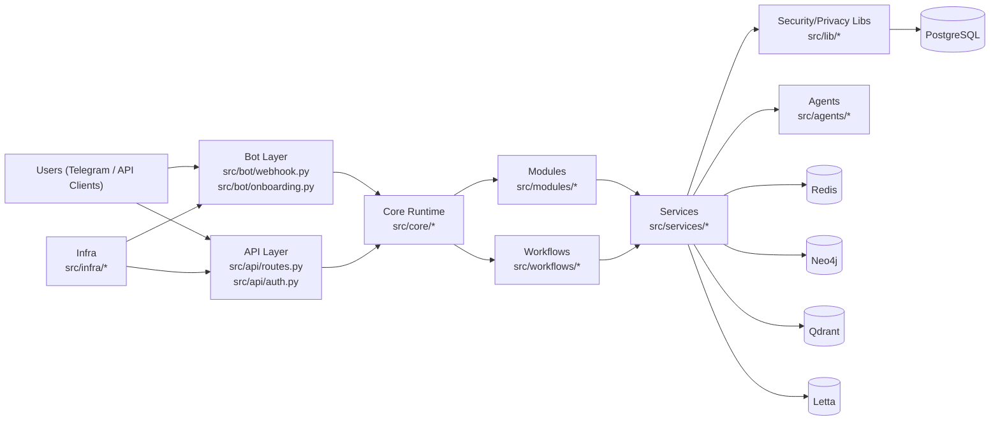

# DEEP PROJECT AUDIT -- Aurora Sun V1 (Regenerated)

**Audit Date:** 2026-02-14  
**Mode:** Read-only analysis (no code changes)  
**Reason for this version:** prior report was overwritten; this is a full reconstruction of the previously reported findings.

---

## PHASE 0: RECONNAISSANCE

### Project inventory

- Primary language: Python
- Repository shape: `src/`, `tests/`, `docs/`, `scripts/`, `migrations/`, `.github/workflows/`
- Text files scanned: 207
- Total lines scanned: 82,906
- Python files analyzed: 178

### Detected stack

| Area | Technology | Evidence |
|---|---|---|
| Runtime | Python `>=3.11` | `pyproject.toml` |
| Packaging | setuptools build backend | `pyproject.toml` |
| ORM | SQLAlchemy 2.x | `pyproject.toml`, `src/models/*` |
| Migrations | Alembic | `alembic.ini`, `migrations/env.py` |
| Bot | python-telegram-bot | `pyproject.toml`, `src/bot/*` |
| Caching | Redis | `src/services/redis_service.py` |
| Datastores | Postgres, Redis, Neo4j, Qdrant, Letta | `docker-compose.prod.yml` |
| Lint | Ruff | `pyproject.toml` |
| Type checking | mypy strict | `pyproject.toml`, `.github/workflows/ci.yml` |
| Testing | pytest, pytest-cov | `pyproject.toml` |
| Security scan | Bandit | `.github/workflows/ci.yml` |
| CI/CD | GitHub Actions | `.github/workflows/ci.yml` |

### Architecture map (Mermaid)



---

## PHASE 1: ARCHITECTURE REVIEW

### 1) Project structure

- Overall package decomposition is strong and mostly scalable.
- Internal dependency scan found no package-level cycles.

**Finding A-01**  
**Problem:** API layer is still effectively placeholder logic, not a production framework integration.  
**Impact:** Runtime behavior can diverge from documented API claims; security/auth paths are not end-to-end wired.  
**Recommendation:** Replace placeholder router with real FastAPI router + dependency injection + middleware/auth chain.

Evidence:

```python
# src/api/routes.py:33-38
class APIRouter:
    """
    ...placeholder implementation. In production, this would use FastAPI.
    """
```

```python
# src/api/routes.py:114-118
return {
    "access_token": f"mock_token_for_{telegram_id}",
    "token_type": "Bearer",
    "expires_in": 2592000,
}
```

### 2) Separation of concerns

**Finding A-02**  
**Problem:** Session/state initialization pattern stores coroutine objects in modules and awaits them repeatedly.  
**Impact:** runtime crashes (`cannot reuse already awaited coroutine`) in core user flows.  
**Recommendation:** await state store once during async init (or lazy getter) and keep resolved instance.

Evidence:

```python
# src/modules/future_letter.py:194
self._state_store = get_state_store()

# src/modules/future_letter.py:263
state_store = await self._state_store
```

### 3) Data flow boundaries

**Finding A-03**  
**Problem:** multiple services still rely on in-memory stores in paths that read like production behavior.  
**Impact:** restart data loss, multi-instance inconsistency, difficult recovery semantics.  
**Recommendation:** enforce persistent backend in prod mode, explicit mock backend in tests.

Evidence:

```python
# src/services/revenue_tracker.py:218
self._entries: dict[int, list[dict[str, str | int | None]]] = {}
```

```python
# src/services/crisis_service.py:319
self._crisis_log: dict[int, list[dict[str, str | int | None]]] = {}
```

### 4) API design consistency

**Finding A-04**  
**Problem:** no explicit API versioning and route placeholders return mocked data.  
**Impact:** unstable client contract and unclear migration strategy.  
**Recommendation:** move to `/api/v1`, typed request/response contracts, and standardized error envelope.

---

## PHASE 2: CODE QUALITY ANALYSIS

### Complexity metrics (automated)

- Functions > 50 LOC: **114**
- Functions with nesting > 3: **46**
- Functions with estimated CC >= 15: **16**

Top hotspots:

| Function | File:Line | LOC | Nesting | Est. CC |
|---|---|---:|---:|---:|
| `generate_weekly_report` | `src/services/effectiveness.py:714` | 149 | 2 | 29 |
| `detect_cycles` | `src/services/pattern_detection.py:558` | 137 | 4 | 27 |
| `export_user_data` | `src/lib/gdpr.py:224` | 127 | 3 | 27 |
| `can_attempt_task` | `src/services/energy_system.py:715` | 75 | 3 | 25 |
| `compare_variants` | `src/services/effectiveness.py:557` | 156 | 5 | 24 |
| `_run_pipeline` | `src/modules/money.py:924` | 136 | 9 | 18 |

### Code smells

**Finding Q-01 (God functions / deep nesting)**  
**Problem:** several high-risk functions are oversized and deeply nested.  
**Impact:** high regression risk and low local readability.  
**Recommendation:** split by decision phase (parse, validate, classify, persist, emit).

**Finding Q-02 (heuristic collisions)**  
**Problem:** conflicting keyword rules in financial parsing (`"paid"` appears in income and expense lists).  
**Impact:** misclassification of transactions.

Evidence:

```python
# src/services/revenue_tracker.py:186-193
INCOME_KEYWORDS = [..., "paid", ...]
EXPENSE_KEYWORDS = ["spent", "paid", "bought", "cost", "expense", "for", ...]
```

**Finding Q-03 (TODO density in production paths)**  
**Problem:** 72 TODOs in `src/` including module/workflow paths.  
**Impact:** behavior appears implemented but is partially stubbed.

Examples:
- `src/workflows/daily_workflow.py:592`
- `src/workflows/daily_graph.py:403`
- `src/modules/capture.py:590`
- `src/modules/planning.py:790`

### Naming/readability

**Finding Q-04**  
**Problem:** contract drift between tests and code for `SegmentContext` and `SideEffectType` usage patterns.  
**Impact:** brittle tests and frequent regressions after refactors.  
**Recommendation:** transitional adapters or synchronized test migration with explicit deprecation window.

---

## PHASE 3: DEPENDENCY & SECURITY AUDIT

### 3.1 Tool results

- `bandit -r src`: **17 findings** total
  - 1 High, 16 Low
- `pip-audit`: blocked by network/DNS restrictions in this environment

Bandit high issue:

```python
# src/services/coaching_engine.py:332
hash_value = int(hashlib.md5(hash_input.encode()).hexdigest()[:8], 16)
```

### 3.2 Security findings by severity

#### 🔴 Critical

**S-01: Auth/API inconsistency in live paths**  
- Mock token issuance in API route (`src/api/routes.py:114-118`) plus runtime auth defects.

**S-02: Auth implementation runtime defect**  
- Missing imports break token encode/decode in some paths.

Evidence:

```python
# src/api/auth.py:159
signature = hmac.new(..., hashlib.sha256).hexdigest()
# hmac/hashlib not imported at module scope used by this code path
```

#### 🟠 High

**S-03: Webhook secret integration compatibility issue**  
- `builder.secret_token(...)` path is not stable against the typed builder interface observed by mypy/tests.

Evidence:

```python
# src/bot/webhook.py:366
builder = builder.secret_token(webhook_secret)
```

**S-04: State coroutine reuse crash in user flows**  
- `future_letter` and `planning` repeat-await same coroutine object.

#### 🟡 Medium

**S-05: CORS policy not explicitly configured in app code**  
- No CORS middleware/config hits in `src/`.

**S-06: Config contract mismatch**  
- `AURORA_API_SECRET_KEY` required in `AuthService`, but not documented in `.env.example`/README.

#### 🔵 Low

**S-07: broad exception swallowing patterns**  
- multiple `except Exception: pass` or broad catch blocks in runtime code.

---

## PHASE 4: TEST AUDIT

### Test run summary

Run with `PYTHONPATH=.` and full suite:

- Total executed: **2367**
- Pass: **2246**
- Fail: **97**
- Error: **24**
- Warnings: **561-562**
- Runtime: **~15.3-15.6s**
- Coverage: **82%** (`TOTAL 12102 stmts, 2172 miss`)

### Failure clustering (root cause groups)

| Cluster | Count | Root cause |
|---|---:|---|
| Coroutine reuse | 30 | `get_state_store()` coroutine stored/awaited repeatedly |
| TensionEngine fixture setup | 24 errors | test patch target no longer exists (`get_redis_service`) |
| Auth env dependency | 12 | `AURORA_API_SECRET_KEY` required and not injected in tests |
| Review db hard dependency | 12 | missing db session raises runtime error |
| SegmentContext contract drift | 11 | tests expect old top-level fields |
| Auth import defect | 1+ | `hmac` NameError path |

### Per-file failing hotspots

Top failing/error files:

- `tests/src/services/test_tension_engine.py` (24 errors)
- `tests/src/api/test_auth.py` (13 failures)
- `tests/src/services/test_coaching_engine.py` (13 failures)
- `tests/src/core/test_segment_service.py` (11 failures)
- `tests/src/modules/test_planning.py` (multiple failures, mostly coroutine reuse)
- `tests/src/modules/test_future_letter.py` (coroutine reuse failures)
- `tests/src/modules/test_review.py` (db session runtime failures)
- `tests/src/lib/test_security.py` (SQL sanitizer expectation drift)

### Test quality assessment

- Good: broad coverage and many domain-level tests.
- Risks:
  - many brittle assertion patterns on exact strings/internal shape.
  - shared-state/order sensitivity indicated by variance across runs.
  - contract drift not managed with backward-compat test layers.

### Coverage gaps (critical risk order)

| Path | Coverage |
|---|---:|
| `src/api/schemas.py` | 0% |
| `src/services/neurostate/energy.py` | 27% |
| `src/services/neurostate/channel.py` | 29% |
| `src/services/neurostate/sensory.py` | 30% |
| `src/services/neurostate/masking.py` | 36% |
| `src/services/tension_engine.py` | 59% |
| `src/modules/planning.py` | 62% |
| `src/lib/security.py` | 63% |

---

## PHASE 5: ERROR HANDLING & RESILIENCE

### Error handling patterns

**Finding R-01**  
**Problem:** broad exception handling appears in core paths (`except Exception` and silent `pass`).  
**Impact:** hidden failures, difficult diagnosis, inconsistent user behavior.  
**Recommendation:** typed exceptions + central error mapping + telemetry tags.

### Logging

- Structured logging exists in many places.
- Mixed pattern quality (structured + ad-hoc string logs).
- Positive: user-id hashing used in security-sensitive logs.

### Graceful degradation

- Redis fallback strategy present.
- Some modules fail hard instead of degrade (e.g., review without db session).
- No clear circuit-breaker pattern found.

---

## PHASE 6: DEVX & MAINTENANCE

### Onboarding (<30 min) assessment

Current state: **No** (blocked by setup drift).

Key blockers:

1. README run command is invalid for current package:

```bash
python -m src
# -> No module named src.__main__
```

2. README references `docker-compose.yml`; repo contains `docker-compose.prod.yml` only.
3. CI references `Dockerfile`; file not present.
4. required auth env var `AURORA_API_SECRET_KEY` not documented in `.env.example`.

### CI/CD assessment

- Good breadth: tests, lint, typing, bandit, coverage gate, docker build, deploy.
- Gaps:
  - pipeline/repo artifact drift (Dockerfile missing).
  - security stage not fail-closed (`bandit ... || true`).
  - strict checks currently failing in source (`ruff src`, `mypy src --strict`).

### Type safety

`mypy src --strict` currently reports **11 errors** across:
- `src/api/auth.py`
- `src/services/redis_service.py`
- `src/services/knowledge/qdrant_service.py`
- `src/bot/webhook.py`

### Git hygiene (visible)

- commit history uses structured prefixes (`feat`, `fix`, `docs`, `audit`).
- no PR template evidence in `.github` from scanned files.

---

## PHASE 7: PROJECT MATURITY ASSESSMENT

### Assigned stage: 🟠 EARLY DEVELOPMENT

Rationale:
- Strong architectural intent and module decomposition.
- Substantial test suite exists, but current fail/error volume is incompatible with production confidence.
- Security/privacy foundations are present, but auth/runtime integration and config drift remain unresolved.

---

## PHASE 8: QUALITY SCORECARD

| Category | Score | Weight | Weighted |
|---|---:|---:|---:|
| Architecture & Design | 58 | 20% | 11.6 |
| Code Quality | 52 | 20% | 10.4 |
| Test Coverage & Quality | 48 | 15% | 7.2 |
| Security | 54 | 15% | 8.1 |
| Error Handling & Resilience | 50 | 10% | 5.0 |
| Dependencies & Maintenance | 60 | 10% | 6.0 |
| Documentation & DevX | 40 | 5% | 2.0 |
| Performance | 58 | 5% | 2.9 |
| **TOTAL** |  |  | **53.2 / 100** |

### Category notes (short)

- **Architecture (58):** good modular decomposition, but API/state wiring inconsistencies are material.
- **Code Quality (52):** high complexity concentration and TODO density in production paths.
- **Test Quality (48):** broad suite but high fragility and contract drift.
- **Security (54):** strong building blocks but auth/webhook path risks remain.
- **Resilience (50):** fallbacks exist, but broad exception handling and hard runtime failures reduce confidence.
- **Dependencies (60):** modern baseline; unresolved CVE audit due network; possible dependency bloat.
- **DevX (40):** docs/setup drift blocks fast onboarding.
- **Performance (58):** no immediate catastrophic signals; complexity in hot paths is a scalability risk.

---

## PHASE 9: EXECUTIVE SUMMARY

### TL;DR (3 sentences)

Aurora Sun V1 has a strong structural foundation and serious engineering ambition, especially in segmentation, privacy, and domain breadth. The project is not production-ready yet due to unresolved runtime defects in auth/state flows and a large cluster of failing tests driven by both real code issues and contract drift. The fastest path forward is a stabilization sprint focused on auth correctness, state-store lifecycle fixes, and deterministic test hardening.

### Maturity

**🟠 Early Development** -- stable architecture direction, unstable execution layer.

### Overall score

**53.2/100**

### 🔴 Critical issues (immediate action)

| Issue | File | Impact |
|---|---|---|
| Mock token endpoint | `src/api/routes.py:114` | auth path not production-safe |
| Auth runtime defect (`hmac/hashlib`) | `src/api/auth.py:159` | token encode/decode path can crash |
| Coroutine reuse in core user flows | `src/modules/future_letter.py:194`, `src/modules/planning.py:167` | repeated interactions crash |

### 🟠 High priority (next sprint)

| Issue | File | Impact |
|---|---|---|
| Webhook secret integration mismatch | `src/bot/webhook.py:366` | webhook setup/runtime compatibility risk |
| Test fixture/API drift in tension engine | `tests/src/services/test_tension_engine.py:60` | 24 setup errors block trust |
| Missing env contract docs (`AURORA_API_SECRET_KEY`) | `src/api/auth.py:115`, `.env.example` | setup + CI inconsistency |
| CI Docker artifact drift | `.github/workflows/ci.yml` vs missing `Dockerfile` | build/deploy pipeline fragility |

### 🟡 Medium priority (backlog)

| Issue | File | Impact |
|---|---|---|
| Financial keyword conflicts | `src/services/revenue_tracker.py:186-193` | misclassified transactions |
| Review module hard-fails without db session | `src/modules/review.py:157` | user flow brittleness |
| CORS not explicitly configured | `src/*` | unclear browser security boundary |
| High TODO density | multiple `src/modules/*`, `src/workflows/*` | latent behavior gaps |

### Recommended roadmap (Top 10)

| Priority | Action | Effort |
|---|---|---|
| 1 | Fix auth runtime path and remove mock token route behavior | M |
| 2 | Resolve state-store coroutine lifecycle bug in module flows | S |
| 3 | Stabilize webhook secret integration against actual PTB API | S |
| 4 | Synchronize README, `.env.example`, and CI artifact assumptions | S |
| 5 | Make test environment deterministic (singleton reset + env fixtures) | M |
| 6 | Reconcile SegmentContext and SideEffect contract drift in tests | M |
| 7 | Refactor high-risk parser heuristics with prioritized rules/tests | M |
| 8 | Raise coverage on low-covered neurostate/security/core API paths | M |
| 9 | Enforce security scan policy (fail on high severity) | S |
| 10 | Replace broad catch/pass with typed exception strategy | M |

### Project strengths (at least 3)

1. Clear domain decomposition across core/modules/services/agents/infra.
2. Strong privacy/security intent (encryption, consent, GDPR/CCPA modules).
3. Large automated test surface and established quality tooling pipeline.
4. Comprehensive internal documentation footprint.

---

## APPENDIX: Key quantified findings

- Python files analyzed: 178
- Functions analyzed: 3,576
- Functions >50 LOC: 114
- Functions nesting >3: 46
- High complexity functions (CC>=15): 16
- TODO markers in `src/`: 72
- `ruff check src`: 6 findings
- `mypy src --strict`: 11 errors
- `bandit -r src`: 17 findings (1 high, 16 low)
- Test run baseline: 2246 passed, 97 failed, 24 errors
- Coverage baseline: 82%

