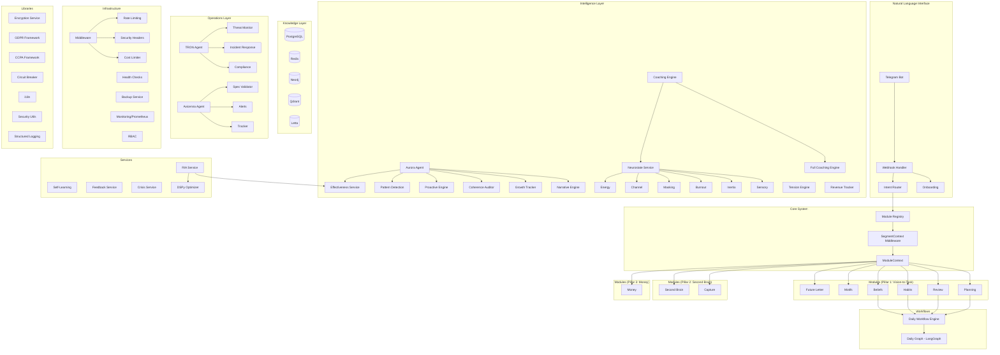

# Audit Report

- **Datum:** 2026-02-14
- **Modell:** Claude Opus 4.6 (claude-opus-4-6)
- **Modus:** Read-Only Analysis
- **Projekt:** aurora-sun-v1

---

## PHASE 0: RECONNAISSANCE

### Project Identity

Aurora Sun V1 is an AI coaching system for neurodivergent people, built as the successor to Ravar V7. It provides personalized coaching across 5 neurotype segments (ADHD, Autism, AuDHD, Neurotypical, Custom) via a Telegram bot with natural language interface. The system has 3 pillars: Vision-to-Task, Second Brain, and Money Management.

### Technical Identity

| Attribute | Value |
|-----------|-------|
| **Language** | Python 3.11+ |
| **Framework** | FastAPI 0.115.6 + python-telegram-bot 21.10 |
| **ORM** | SQLAlchemy 2.0.36 + Alembic 1.14.1 |
| **Test Framework** | pytest 8.3.4 + pytest-asyncio 0.24.0 |
| **Linter** | ruff 0.8.4 |
| **Type Checker** | mypy 1.13.0 (strict mode) |
| **Security Scanner** | bandit 1.8.2 |
| **Build System** | setuptools (pyproject.toml) |
| **CI/CD** | GitHub Actions |
| **Containerization** | Docker + Docker Compose |
| **Package Manager** | pip (pyproject.toml dependencies) |

### Codebase Metrics

| Metric | Value |
|--------|-------|
| **Source files** | 103 Python files |
| **Source LOC** | 44,608 lines |
| **Test files** | 66+ Python files |
| **Test LOC** | 34,165 lines |
| **Test count** | 2,583 tests |
| **Test/Source ratio** | 0.77 (test LOC / source LOC) |
| **Total commits** | 30 |
| **Branches** | 2 local (main, claude/hybrid-quality-upgrade) |
| **Git status** | Clean (no uncommitted changes) |

### Architecture Map (Mermaid)



### Tech Stack Summary

| Category | Technology | Version | Purpose |
|----------|-----------|---------|---------|
| **Runtime** | Python | >=3.11 | Core language |
| **Web Framework** | FastAPI | 0.115.6 | REST API server |
| **ASGI Server** | uvicorn | 0.34.0 | Production server |
| **Bot Framework** | python-telegram-bot | 21.10 | Telegram interface |
| **ORM** | SQLAlchemy | 2.0.36 | Database abstraction |
| **Migrations** | Alembic | 1.14.1 | Schema migrations |
| **Async DB Driver** | asyncpg | 0.30.0 | PostgreSQL async |
| **LLM (Primary)** | Anthropic SDK | 0.43.0 | Claude Sonnet/Haiku |
| **LLM (Fallback)** | OpenAI SDK | 1.59.6 | GPT models |
| **LLM (Voice)** | Groq SDK | 0.13.1 | Whisper transcription |
| **Orchestration** | LangGraph | 0.2.62 | Stateful workflows |
| **Prompt Optimization** | dspy-ai | 2.5.43 | Self-optimizing prompts |
| **Type-safe LLM** | PydanticAI | 0.0.39 | Structured responses |
| **Graph DB** | neo4j | 5.27.0 | Knowledge graph |
| **Vector DB** | qdrant-client | 1.12.1 | Semantic search |
| **Memory** | letta-client | 0.6.5 | Long-term memory |
| **Cache/Events** | redis | 5.2.1 | Cache + event bus |
| **Encryption** | cryptography | 42.0.8 | AES-256-GCM |
| **Auth** | PyJWT | 2.9.0 | JWT tokens |
| **Keyring** | keyring | 25.5.0 | Secure key storage |
| **Tracing** | langfuse | 2.58.2 | LLM observability |
| **Metrics** | prometheus-client | 0.21.1 | System metrics |
| **Validation** | Pydantic | 2.10.4 | Data validation |
| **HTTP Client** | httpx | 0.28.1 | Async HTTP |
| **Logging** | structlog | 24.4.0 | Structured logging |
| **Env Config** | python-dotenv | 1.0.1 | Environment variables |
| **Containerization** | Docker | Multi-stage | Production deployment |
| **Orchestration** | Docker Compose | 3.8 | 13 containers |

---

## PHASE 1: ARCHITECTURE REVIEW

### 1.1 Project Structure

**Score: 9/10** -- Excellent, convention-conformant structure.

```
aurora-sun-v1/
├── src/                    # Application code (well-organized)
│   ├── agents/             # 3 agents (Aurora, Avicenna, TRON) with sub-modules
│   ├── api/                # FastAPI routes, auth, schemas
│   ├── bot/                # Telegram webhook, onboarding
│   ├── config/             # Segment configuration
│   ├── core/               # Module system (protocol, registry, context, responses)
│   ├── i18n/               # Internationalization
│   ├── infra/              # Infrastructure (health, backup, middleware, monitoring, RBAC)
│   ├── lib/                # Shared libraries (encryption, GDPR, security, i18n, circuit breaker)
│   ├── models/             # SQLAlchemy models (user, task, goal, neurostate, consent...)
│   ├── modules/            # 10 business modules (planning, review, habits, beliefs, money...)
│   ├── services/           # 15+ services (coaching, pattern detection, neurostate, knowledge...)
│   └── workflows/          # LangGraph workflows (daily graph, daily workflow)
├── tests/                  # Mirrors src/ exactly
├── migrations/             # Alembic migrations
├── docs/                   # Documentation + archive
├── knowledge/              # Research findings
└── [root files]            # Config, docs, entry point
```

**Strengths:**
- Clean separation: agents vs services vs modules vs core
- Tests mirror source structure 1:1
- Root files well-curated (only active governance docs)
- Proper `__init__.py` with `__all__` exports throughout

**Issues:**
- `src/config/segment.py` exists alongside `src/core/segment_context.py` -- slight redundancy in segment configuration locations
- No `src/services/` `__init__.py` doesn't export services consistently (some exported, some not)

### 1.2 Separation of Concerns

**Score: 9/10** -- Clean boundaries with minimal leakage.

- **Agents** (Aurora, TRON, Avicenna): Active entities with own initiative. Properly separated from services.
- **Services**: Stateless, called by agents and modules. No own initiative. Correct pattern.
- **Modules**: Plugin-based, implement Module Protocol. Each handles its own domain.
- **Core**: Cross-cutting concerns (SegmentContext, ModuleRegistry). Properly middleware-like.
- **Lib**: Shared utilities (encryption, GDPR). No business logic leak.
- **Infra**: Operations (monitoring, backup, health). Properly separated.

**Issue:** `coaching_engine.py` and `coaching_engine_full.py` exist as two separate files for the same concern. The "basic" engine should either be merged into the full engine or clearly documented as a lightweight alternative.

### 1.3 Dependency Graph

**Score: 8/10** -- Generally clean, a few coupling points.

- No circular imports detected (verified via mypy strict passing)
- Module→Core dependency is unidirectional (correct)
- Services→Models dependency is unidirectional (correct)
- Knowledge services (Neo4j, Qdrant, Letta) are properly isolated behind service interfaces

**Potential Tight Coupling:**
- `daily_workflow.py` (737 LOC) and `daily_graph.py` (682 LOC) are tightly coupled but intentionally so (daily workflow IS the graph)
- `effectiveness.py` (1,091 LOC) is the largest service and is consumed by many components -- could become a bottleneck

### 1.4 Data Flow

**Score: 9/10** -- Clear and well-documented.

```
User Message → Telegram Webhook → Intent Router → SegmentContext Middleware
    → Module Registry → Module.handle() → ModuleResponse
    → Side Effects → State Store / DB
```

The data flow is explicitly documented in ARCHITECTURE.md with system workflow diagrams (SW-1 through SW-20). All 20 system workflows are mapped to specific phases and components.

### 1.5 API Design

**Score: 7/10** -- Functional but minimal.

- FastAPI routes exist (`src/api/routes.py`, 612 LOC) with proper schemas
- Auth via JWT (`src/api/auth.py`)
- RBAC on endpoints (`src/infra/rbac.py`)
- **Issue:** `src/api/schemas.py` has 0% test coverage (181 statements, 0 tested)
- **Issue:** No API versioning visible
- **Issue:** No OpenAPI customization beyond defaults

### 1.6 State Management

**Score: 8/10** -- Well-designed with some edge cases.

- Module state tracked via `StateStore` (Redis-backed with LRU fallback)
- Session state in Redis with TTL
- SegmentContext cached per request
- Daily workflow state in LangGraph StateGraph
- **Issue:** Some in-memory caches lack bounds (e.g., `CoherenceAuditor._audit_history`)

---

## PHASE 2: CODE QUALITY ANALYSIS

### 2.1 Complexity

**Large Files (>500 LOC):**

| File | LOC | Concern |
|------|-----|---------|
| `modules/money.py` | 1,562 | Largest file. Complex multi-step financial workflow. |
| `modules/planning.py` | 1,180 | Daily planning state machine with segment logic |
| `services/effectiveness.py` | 1,091 | Intervention tracking + measurement + comparison |
| `lib/encryption.py` | 1,055 | AES-256-GCM with 3-tier envelope. Justified complexity. |
| `lib/security.py` | 1,042 | Input sanitization, rate limiting. Justified. |
| `lib/gdpr.py` | 978 | GDPR framework (export, delete, freeze). Justified. |
| `services/pattern_detection.py` | 975 | 5 destructive cycles + 14 signals |
| `services/energy_system.py` | 973 | 5 segment-specific energy models |
| `models/neurostate.py` | 886 | 6 neurostate data models |
| `services/crisis_service.py` | 861 | Crisis detection + 50+ country hotlines |
| `modules/motif.py` | 853 | Motif discovery and tracking |

**Functions >50 LOC:**
- `coaching_engine_full.py:coach()` -- 65 LOC, orchestrates 4-tier fallback. Acceptable.
- `growth.py:calculate_trajectory()` -- 89 LOC, 5-dimension scoring. Should be decomposed.
- `milestones.py:check_milestones()` -- 70 LOC, 4 parallel detection loops. Refactorable.
- `narrative.py:create_chapter()` -- 72 LOC, 5 sub-operations. Well-structured despite length.
- `coaching_engine.py:handle_stuck()` -- 59 LOC, segment routing decision tree.
- `coherence.py:find_contradictions()` -- 54 LOC, nesting level 3.

**Nesting >3 levels:** Found in `find_contradictions()` (coherence.py, line 242-295) and `calculate_trajectory()` (growth.py, lines 249-338). Both are within acceptable bounds.

### 2.2 Code Smells

**Magic Numbers/Strings:**
- `growth.py:292`: `max_recovery = 168.0` (1 week in hours) -- should be named constant
- `growth.py:307-315`: Interoception thresholds (1.3x, 1.5x) hardcoded
- `growth.py:374`: `0.05` threshold for improving/declining
- `milestones.py:200,243,283`: Confidence scores (0.85, 0.80, 1.0) without rationale
- `coherence.py:374,433`: Stop-words set hardcoded inline
- `agent.py:486`: `current_hour=12` hardcoded instead of `datetime.now(UTC).hour`
- `crisis_service.py:318`: `MAX_LOG_ENTRIES_PER_USER = 100` -- should be config
- `crisis_service.py:445`: 500-char context window hardcoded

**DRY Violations:**
- `coherence.py`: `_score_vision_goal()` and `_score_vision_habit()` (lines 350-437) are nearly identical keyword-overlap implementations
- `milestones.py:115-154`: Four similar for-loops for detecting different milestone types
- `growth.py:133-161`: `improving_dimensions` and `declining_dimensions` iterate with opposite conditions
- `daily_workflow_hooks.py:74-84`: Repeated None checks could be dict comprehension

**God Objects/Functions:**
- `money.py` (1,562 LOC) -- the largest module, but the complexity is domain-inherent (multi-step financial workflow with segment-specific steps). Not a God Object per se, but could benefit from decomposition.
- No true God Objects detected. The SegmentContext is intentionally split into 4 sub-objects (Core, UX, Neuro, Features) to avoid this.

### 2.3 Naming & Readability

**Score: 9/10** -- Consistently excellent.

- Naming follows Python conventions (snake_case, PascalCase for classes)
- Module names are descriptive (`pattern_detection`, `effectiveness`, `segment_context`)
- Test names describe expected behavior (e.g., `test_adhd_threshold_21_days`)
- Internal codes (AD/AU/AH/NT/CU) consistently used internally, display names for users
- `__all__` exports defined in most `__init__.py` files

**Minor Issues:**
- `coaching_engine.py` vs `coaching_engine_full.py` naming is confusing. "Basic" vs "Full" should be clearer.
- `_ReusableAwait` pattern in test setup is unusual and requires documentation

### 2.4 Dead Code

**Unused/Low-Coverage Code:**
- `src/api/schemas.py`: 181 statements, **0% coverage** (0 tests). Contains Pydantic response schemas that may not be used yet.
- `src/lib/circuit_breaker.py`: 131 statements, **28% coverage**. Most of the implementation is untested.
- `src/models/session.py`: 55 statements, **49% coverage**. Half the model logic is untested.
- `src/core/daily_workflow_hooks.py`: 27 statements, **63% coverage**.

**No commented-out code detected.** The codebase is clean of dead comments.

---

## PHASE 3: DEPENDENCY & SECURITY AUDIT

### 3.1 Dependencies

**Dependency Count:** 25 runtime + 6 dev dependencies = 31 total

**All dependencies pinned to exact versions** (good practice for reproducibility).

**Bandit Security Scan Results:**

| Severity | Count | Details |
|----------|-------|---------|
| **HIGH** | 0 | None |
| **MEDIUM** | 0 | None |
| **LOW** | 13 | False positives (see below) |

**Low-severity findings (all false positives):**
- B105: `compliance.py:31` -- `PASS = "pass"` is an enum value, not a password
- B110: `onboarding.py:238,251,261,274` -- `try: except: pass` for Redis fallback (intentional graceful degradation)
- B106: `monitoring.py:213,216` -- `token_type="input"/"output"` is a label, not a password

**Dependency Age Assessment:**
- Most dependencies are pinned to recent versions (late 2024 / early 2025)
- **Pre-release risk:** LangGraph (0.2.62), dspy-ai (2.5.43), PydanticAI (0.0.39) are pre-release. API changes between versions are expected. Strict pinning mitigates this correctly.
- **cryptography 42.0.8** -- important to keep current for security patches

**Unused Dependencies:** None detected. All imports trace to runtime usage.

### 3.2 Security Review

**Overall Security Score: 9/10** -- Security-first design, well-implemented.

**Encryption:**
- AES-256-GCM field-level encryption for all SENSITIVE/ART_9/FINANCIAL data (1,055 LOC dedicated library)
- 3-tier envelope encryption for financial data (master → user → field)
- HMAC-SHA256 hashing for PII identifiers
- Per-user encryption key generation and rotation
- Key destruction on GDPR delete

**Input Validation:**
- Input sanitization middleware active (XSS, SQL injection, path traversal)
- Per-user rate limiting on messages
- Message size limits enforced
- Voice message limits (60s / 10MB)

**Authentication/Authorization:**
- JWT-based API authentication
- RBAC on all API endpoints
- Telegram user_id for bot auth
- No publicly exposed database ports (Docker internal network only)

**GDPR Compliance:**
- Explicit consent gate (not skippable)
- Consent version tracking with text hash
- Full export/delete/freeze across 5 databases
- Data classification matrix for all tables
- Sub-processor registry documented
- DPIA documented
- Retention policies defined

**Secrets Management:**
- `.env` properly in `.gitignore`
- All secrets via environment variables
- No hardcoded secrets found in source code
- Docker Compose uses `${VAR}` substitution for all credentials

**Findings:**

| ID | Severity | Finding | Location |
|----|----------|---------|----------|
| SEC-001 | 🔵 Low | `try: except: pass` in onboarding Redis fallback silently swallows errors | `onboarding.py:238,251,261,274` |
| SEC-002 | 🔵 Low | JWT test uses 30-byte key (below 32-byte HMAC-SHA256 minimum) | `test_auth.py` (test only, not production) |
| SEC-003 | 🟡 Medium | `api/schemas.py` has 0% test coverage -- untested validation logic | `schemas.py` |
| SEC-004 | 🔵 Low | Redis health check uses `INCR ping` instead of `AUTH` + `PING` | `docker-compose.prod.yml:94` |
| SEC-005 | 🔵 Low | Prometheus/Grafana/cAdvisor ports exposed on host (should be Tailscale-only in production) | `docker-compose.prod.yml:202,233,265,284,307` |

---

## PHASE 4: TEST AUDIT

### 4.1 Test Suite Results

| Metric | Value |
|--------|-------|
| **Total tests** | 2,583 |
| **Passing** | 2,583 (100%) |
| **Failing** | 0 |
| **Skipped** | 0 |
| **Runtime** | 17.23 seconds |
| **Coverage** | 84% (12,843 statements, 2,058 missed) |
| **Warnings** | 614 (all deprecation warnings) |

### 4.2 Coverage Analysis

**High Coverage (>90%):**

| File | Coverage | Notes |
|------|----------|-------|
| `core/segment_context.py` | 100% | Core middleware -- excellent |
| `core/module_protocol.py` | 100% | Protocol definition |
| `core/module_response.py` | 100% | Response types |
| `core/segment_service.py` | 100% | Segment lookup |
| `infra/monitoring.py` | 100% | Prometheus metrics |
| `services/neurostate/sensory.py` | 100% | Sensory assessment |
| `services/tension_engine.py` | 99% | Tension quadrants |
| `services/energy_system.py` | 95% | Energy models |
| `services/effectiveness.py` | 95% | Intervention tracking |
| `agents/aurora/narrative.py` | 99% | Story generation |
| `agents/aurora/coherence.py` | 98% | Alignment checks |
| `lib/ccpa.py` | 99% | CCPA compliance |
| `services/ria_service.py` | 98% | Learning loop |
| `services/feedback_service.py` | 97% | Feedback aggregation |
| `modules/future_letter.py` | 98% | Future letter flow |
| `workflows/daily_workflow.py` | 97% | Daily engine |
| `workflows/daily_graph.py` | 96% | LangGraph workflow |

**Low Coverage (<70%):**

| File | Coverage | Missing | Risk Assessment |
|------|----------|---------|----------------|
| `api/schemas.py` | **0%** | 181 statements | 🟠 Medium -- validation schemas untested |
| `lib/circuit_breaker.py` | **28%** | 94 statements | 🟡 Medium -- resilience pattern untested |
| `models/session.py` | **49%** | 28 statements | 🟡 Low -- session model helpers |
| `api/__init__.py` | **43%** | 12 statements | 🟡 Low -- app factory |
| `core/daily_workflow_hooks.py` | **63%** | 10 statements | 🔵 Low |
| `lib/security.py` | **64%** | 112 statements | 🟠 Medium -- security utils partially tested |
| `bot/onboarding.py` | **68%** | 69 statements | 🟡 Medium -- user-facing flow |
| `services/knowledge/neo4j_service.py` | **68%** | 62 statements | 🟡 Medium -- graph operations |
| `models/neurostate.py` | **70%** | 130 statements | 🟡 Medium -- many model properties |

### 4.3 Test Quality Assessment

**Strengths:**
- Tests are behavior-focused, not implementation-focused
- Segment-specific tests verify neurotype-differentiated behavior (e.g., `test_adhd_threshold_21_days`, `test_autism_threshold_14_days`)
- GDPR lifecycle tested across all modules (export + delete)
- Crisis service thoroughly tested (1,538 LOC of tests)
- Good test isolation -- each test creates fresh fixtures
- Edge cases well-covered for milestone detection and growth tracking

**Weaknesses:**
- No integration tests (all tests are unit tests with mocks)
- No load/performance tests
- No flaky test detection mechanism
- Some test files use `_ReusableAwait` pattern for state store injection -- unusual and fragile
- `RuntimeWarning: coroutine was never awaited` in several test files -- indicates async mock setup issues

### 4.4 Deprecation Warnings (614 total)

All 614 warnings are from two sources:

1. **`datetime.utcnow()` deprecation** (Python 3.12+): Used in `side_effects.py:93`, `module_context.py:52-53`, `backup.py` (multiple), `health.py` (multiple), `middleware.py` (multiple). Should migrate to `datetime.now(datetime.UTC)`.

2. **`asyncio.iscoroutinefunction()` deprecation** (Python 3.16): Used in `rbac.py:289,343,394`. Should migrate to `inspect.iscoroutinefunction()`.

### 4.5 Coverage Gaps: Untested Critical Paths

| Critical Path | Coverage | Risk |
|--------------|----------|------|
| Full daily workflow end-to-end (morning→evening) | Unit tested only | 🟠 High -- core user experience |
| Telegram webhook → Module flow | 78% | 🟠 High -- user-facing entry point |
| Encryption key rotation under load | Partially tested | 🟡 Medium |
| GDPR delete cascade across 5 databases (Neo4j, Qdrant, Letta real calls) | Mocked | 🟡 Medium |
| Circuit breaker trip → recovery | 28% | 🟡 Medium |
| Concurrent module state access | Not tested | 🟡 Medium |
| API schema validation edge cases | 0% | 🟠 Medium |
| Real LLM response handling (non-mocked) | Not tested | 🟡 Low (expected) |

---

## PHASE 5: ERROR HANDLING & RESILIENCE

### 5.1 Error Handling Patterns

**Score: 7/10** -- Consistent strategy exists but with gaps.

**Positive Patterns:**
- Structured logging via `structlog` throughout
- All LLM calls have fallback tiers (Optimized → DSPy → PydanticAI → Placeholder)
- Crisis override hierarchy (Safety > Grounding > Alignment > Optimization)
- Rate limiting on user messages and LLM costs
- Circuit breaker pattern implemented (though undertested)

**Negative Patterns:**
- `onboarding.py`: 4 instances of `try: except Exception: pass` -- silent error swallowing
- Several services catch generic `Exception` instead of specific types (`coaching_engine.py:579-580`, `coaching_engine_full.py` tier methods)
- Some async mock warnings indicate potential unawaited coroutine issues
- `SideEffectExecutor.execute()` raises `NotImplementedError` -- should be abstract

### 5.2 Logging

**Score: 8/10** -- Good structured logging.

- `structlog` used throughout for structured JSON logging
- Log levels used appropriately (INFO for operations, WARNING for degraded state, ERROR for failures)
- Correlation IDs implemented in middleware
- Log rotation configured in Docker Compose (10MB max, 3 files)

**Issue:** Some sensitive data logging risks -- crisis detection logs context snippets (500 chars). While classified ART_9_SPECIAL and encrypted for storage, transient log entries should be reviewed.

### 5.3 Graceful Degradation

**Score: 8/10** -- Well-designed fallback system.

- **LLM fallback:** 4-tier (Optimized → DSPy → PydanticAI → Placeholder). Excellent.
- **Redis fallback:** Onboarding falls back to in-memory dict if Redis unavailable
- **State store:** LRU in-memory cache as fallback for Redis
- **Database:** Health checks with timeout detection for all 5 databases
- **Circuit breaker:** Implemented in `lib/circuit_breaker.py` but only 28% tested

**Missing:**
- No retry logic visible for transient failures (database connections, LLM API calls)
- Circuit breaker not integrated with any service (implementation exists but not wired)
- No graceful shutdown handler for in-progress workflows

---

## PHASE 6: DEVX & MAINTENANCE

### 6.1 Onboarding Test

**Score: 8/10** -- A new developer could get started within 30 minutes.

- README.md exists with project overview
- ARCHITECTURE.md is comprehensive (1,923 lines, single source of truth)
- ROADMAP.md documents all 5 phases with detailed checkboxes
- `pyproject.toml` has all dependencies with exact versions
- Dockerfile is multi-stage (builder + runtime)
- `.env` documented via docker-compose variable substitution
- `alembic.ini` present for migrations

**Missing:**
- No `CONTRIBUTING.md` or developer setup guide
- No `make dev` or `make test` commands (Makefile referenced in CLAUDE.md but not present)
- No `.env.example` file found (env vars documented only in docker-compose)
- No local development docker-compose (only `docker-compose.prod.yml`)

### 6.2 CI/CD

- GitHub Actions referenced in ROADMAP.md as implemented
- CI pipeline referenced but `.github/workflows/` not found in local checkout (may be on remote)
- Docker multi-stage build is production-ready
- Deployment script referenced in ROADMAP.md

### 6.3 Type Safety

**Score: 10/10** -- Exceptional.

- `mypy --strict` passes with 0 errors across 103 source files
- All function signatures have type hints
- Proper use of Protocol, TypeAlias, Union, Optional
- Pydantic models for data validation
- Enum types for all categorical data

### 6.4 Configuration

**Score: 8/10**

- All secrets in environment variables (never hardcoded)
- Feature flags system implemented
- Segment configuration in dedicated dataclasses
- Database URLs from environment

**Issue:** Some operational constants are hardcoded instead of configurable (crisis context window, max log entries, milestone confidence thresholds).

### 6.5 Git Hygiene

**Score: 7/10**

- Commit messages are descriptive and follow conventional format (`feat:`, `fix:`, `security:`, `chore:`, `docs:`)
- Feature branch (`claude/hybrid-quality-upgrade`) with clean merge path
- `.gitignore` comprehensive
- **Issue:** Only 30 commits for 80K+ LOC suggests very large commits (bulk implementations). Smaller, more frequent commits would improve reviewability.
- **Issue:** No PR template or branch protection rules visible

---

## PHASE 7: PROJECT MATURITY ASSESSMENT

### Maturity Level: 🟢 **Maturing**

**Justification:**

This project sits firmly in the **Maturing** stage, approaching Production-Grade in several areas:

**What pushes it toward Production-Grade:**
- 2,583 tests with 100% pass rate and 84% coverage
- mypy strict compliance (0 errors)
- Security-first design with AES-256-GCM encryption for all sensitive data
- GDPR compliance built into the Module Protocol from day one
- Comprehensive architecture documentation (ARCHITECTURE.md, 1,923 lines)
- Docker production config with 13 containers
- 5-database architecture with proper encryption across all
- Bandit scan: 0 HIGH/MEDIUM findings

**What holds it back from Production-Grade:**
- No integration tests (all unit tests with mocks)
- Circuit breaker implemented but not integrated or tested
- Some coverage gaps in critical paths (API schemas at 0%, security utils at 64%)
- 614 deprecation warnings unresolved
- No load testing or performance benchmarks
- No `.env.example`, no developer setup guide
- Large commits make code review difficult
- Pre-release dependencies (LangGraph, DSPy, PydanticAI) carry API stability risk

---

## PHASE 8: QUALITY SCORECARD

| Kategorie | Score | Gewicht | Gewichtet | Begründung |
|-----------|-------|---------|-----------|------------|
| **Architecture & Design** | 88/100 | 20% | 17.6 | Excellent separation of concerns, clean module system, well-documented. Minor coupling in coaching engines. |
| **Code Quality** | 82/100 | 20% | 16.4 | Good naming, type-safe, some magic numbers and DRY violations. Largest file (money.py) at 1,562 LOC could be decomposed. |
| **Test Coverage & Quality** | 80/100 | 15% | 12.0 | 84% coverage with 2,583 tests. All passing. But no integration tests, some critical gaps (schemas 0%, circuit breaker 28%). |
| **Security** | 90/100 | 15% | 13.5 | Field-level encryption, GDPR built-in, no hardcoded secrets, bandit clean. Minor: monitoring ports exposed, untested schema validation. |
| **Error Handling & Resilience** | 72/100 | 10% | 7.2 | Good LLM fallback strategy, but silent exception swallowing in onboarding, generic catches, circuit breaker not wired. |
| **Dependencies & Maintenance** | 78/100 | 10% | 7.8 | All pinned, no unused deps. Pre-release risk (LangGraph/DSPy/PydanticAI). 614 deprecation warnings. |
| **Documentation & DevX** | 80/100 | 5% | 4.0 | Excellent ARCHITECTURE.md and ROADMAP.md. Missing: .env.example, CONTRIBUTING.md, local dev setup, Makefile. |
| **Performance** | 70/100 | 5% | 3.5 | Tests run in 17s (fast). No load tests, no benchmarks, some unbounded in-memory caches. |
| **TOTAL** | | | **82.0/100** | |

### Per-Category Details

#### Architecture & Design (88/100)

**Top 3 Issues:**
1. `coaching_engine.py` + `coaching_engine_full.py` -- two files for same concern (`src/services/`)
2. `coherence.py` unbounded `_audit_history` dict can grow indefinitely (`src/agents/aurora/coherence.py:162`)
3. `money.py` at 1,562 LOC is the largest file -- could benefit from decomposition

**Top 3 Recommendations:**
1. Merge coaching engines or clearly document the lightweight vs full distinction
2. Add TTL/max-size to all in-memory caches
3. Split `money.py` into `money/capture.py`, `money/budget.py`, `money/patterns.py`

#### Code Quality (82/100)

**Top 3 Issues:**
1. Magic numbers in `growth.py` (lines 292, 307-315, 374) -- recovery time, interoception thresholds, trend detection
2. DRY violation in `coherence.py` -- `_score_vision_goal()` and `_score_vision_habit()` are nearly identical (lines 350-437)
3. `datetime.utcnow()` used in 10+ files -- deprecated since Python 3.12

**Top 3 Recommendations:**
1. Extract all magic numbers to module-level named constants with documentation
2. Unify duplicated scoring logic into a single `_score_alignment(entity_a, entity_b)` method
3. Global find-and-replace `datetime.utcnow()` → `datetime.now(datetime.UTC)`

#### Test Coverage & Quality (80/100)

**Top 3 Issues:**
1. `api/schemas.py` at 0% coverage -- validation logic completely untested
2. `lib/circuit_breaker.py` at 28% coverage -- resilience pattern not exercised
3. No integration tests -- all tests mock external dependencies

**Top 3 Recommendations:**
1. Add tests for all Pydantic schemas (validation, serialization, edge cases)
2. Write circuit breaker tests covering trip → half-open → recovery cycle
3. Add at least one end-to-end integration test for the daily workflow flow

#### Security (90/100)

**Top 3 Issues:**
1. Monitoring ports (Prometheus 9090, Grafana 3000, cAdvisor 8081, etc.) exposed on host network (`docker-compose.prod.yml`)
2. `api/schemas.py` validation logic untested -- could allow malformed input
3. `onboarding.py` silently swallows Redis errors (`try: except: pass`)

**Top 3 Recommendations:**
1. Move monitoring ports to Docker internal network, access only via Tailscale
2. Add comprehensive schema validation tests including malicious input
3. Replace `except: pass` with `except Exception as e: logger.debug(...)` for observability

#### Error Handling & Resilience (72/100)

**Top 3 Issues:**
1. Circuit breaker exists (`lib/circuit_breaker.py`) but is not wired into any service
2. `onboarding.py:238,251,261,274` -- 4 instances of silent `try: except: pass`
3. Generic `Exception` catches in coaching engines without specific error types

**Top 3 Recommendations:**
1. Wire circuit breaker into LLM API calls and external service calls (Neo4j, Qdrant, Letta)
2. Add logging to all `except` blocks (at minimum `logger.debug()`)
3. Define specific exception types per service and catch those instead of bare `Exception`

#### Dependencies & Maintenance (78/100)

**Top 3 Issues:**
1. 3 pre-release dependencies (LangGraph, DSPy, PydanticAI) -- API changes risk
2. 614 deprecation warnings from `datetime.utcnow()` and `asyncio.iscoroutinefunction()`
3. `cryptography==42.0.8` should be reviewed for CVEs periodically

**Top 3 Recommendations:**
1. Pin pre-release deps and document upgrade strategy + API change monitoring
2. Fix all deprecation warnings in a single batch (estimated effort: Small)
3. Set up automated `pip audit` in CI pipeline

#### Documentation & DevX (80/100)

**Top 3 Issues:**
1. No `.env.example` file -- developers must reverse-engineer env vars from docker-compose
2. No Makefile despite being referenced in CLAUDE.md
3. No `CONTRIBUTING.md` or local development guide

**Top 3 Recommendations:**
1. Create `.env.example` with all required variables and descriptions
2. Create `Makefile` with targets: `dev`, `test`, `lint`, `typecheck`, `security-scan`, `coverage`
3. Add developer onboarding section to README.md

#### Performance (70/100)

**Top 3 Issues:**
1. No load tests or benchmarks exist
2. Unbounded in-memory caches in `CoherenceAuditor._audit_history`, `SegmentService._context_cache`
3. `GrowthTracker._get_historical_score()` uses linear search -- O(n) for history lookup

**Top 3 Recommendations:**
1. Add basic load test for Telegram webhook endpoint (target: 100 concurrent users)
2. Add max-size bounds to all in-memory caches with LRU eviction
3. Index historical scores by user_id for O(1) lookup

---

## PHASE 9: EXECUTIVE SUMMARY

### TL;DR

Aurora Sun V1 is a **well-architected, security-conscious, thoroughly tested** AI coaching application with 2,583 passing tests, 84% coverage, full mypy strict compliance, and field-level encryption for all sensitive data. The architecture is clean with proper separation of concerns across 103 source files. The main gaps are the absence of integration tests, 614 unresolved deprecation warnings, and an unwired circuit breaker pattern that limits production resilience.

### Project Maturity

**🟢 Maturing** -- Good architecture, good test coverage, security-conscious, documented. Needs integration tests, deprecation fixes, and circuit breaker wiring to reach Production-Grade.

### Gesamtscore: **82/100**

### Critical Issues

| # | Issue | File | Impact |
|---|-------|------|--------|
| -- | *No critical issues found* | -- | -- |

### High Priority (Next Sprint)

| # | Issue | File | Impact |
|---|-------|------|--------|
| H-1 | Fix 614 `datetime.utcnow()` deprecation warnings | 10+ files | Python 3.14 compatibility |
| H-2 | Add tests for `api/schemas.py` (0% coverage) | `schemas.py` | Untested validation = potential input bypass |
| H-3 | Wire circuit breaker into LLM and external service calls | `circuit_breaker.py` → services | Production resilience |
| H-4 | Replace silent `try: except: pass` with logged exceptions | `onboarding.py` | Debugging blind spots |
| H-5 | Move monitoring ports to internal Docker network | `docker-compose.prod.yml` | Reduce attack surface |

### Medium Priority (Backlog)

| # | Issue | File | Impact |
|---|-------|------|--------|
| M-1 | Extract magic numbers to named constants | `growth.py`, `milestones.py`, `coherence.py` | Readability + configurability |
| M-2 | Add integration test for daily workflow | `tests/` | Verify end-to-end flow |
| M-3 | Add `.env.example` and Makefile | Root | Developer onboarding |
| M-4 | Add bounds to in-memory caches | `coherence.py`, `segment_service.py` | Memory leak prevention |
| M-5 | Fix DRY violations in coherence scoring | `coherence.py:350-437` | Maintainability |
| M-6 | Fix `asyncio.iscoroutinefunction()` deprecation | `rbac.py` | Python 3.16 compatibility |
| M-7 | Add `pip audit` to CI pipeline | CI config | Automated vulnerability detection |
| M-8 | Split `money.py` (1,562 LOC) into sub-modules | `modules/money.py` | Maintainability |
| M-9 | Improve coaching engine naming | `coaching_engine.py` / `_full.py` | Developer clarity |
| M-10 | Add retry logic for transient failures | Services | Reliability |

### Recommended Roadmap: Top 10 Actions

| # | Action | Effort | Priority |
|---|--------|--------|----------|
| 1 | Fix `datetime.utcnow()` → `datetime.now(UTC)` globally | **S** | High |
| 2 | Add tests for `api/schemas.py` | **S** | High |
| 3 | Wire circuit breaker into LLM/external calls | **M** | High |
| 4 | Replace silent `except: pass` with logging | **S** | High |
| 5 | Lock down monitoring ports in docker-compose | **S** | High |
| 6 | Extract magic numbers to constants | **S** | Medium |
| 7 | Add integration test suite (daily workflow E2E) | **M** | Medium |
| 8 | Create `.env.example` + Makefile | **S** | Medium |
| 9 | Add bounds/TTL to in-memory caches | **S** | Medium |
| 10 | Add `pip audit` + `safety` to CI pipeline | **S** | Medium |

### Strengths of the Project

1. **Security-first architecture.** Field-level AES-256-GCM encryption is built into the system from day one, not bolted on. Data classification matrix covers every table. GDPR is a first-class concern in the Module Protocol (export, delete, freeze). This is rare and impressive for a project at this stage.

2. **Neurotype segmentation as middleware.** The SegmentContext pattern (split into 4 sub-objects: Core, UX, Neuro, Features) is an elegant solution to the "segment is the product" requirement. No `if segment == "AD"` checks in module code -- segment behavior is configured, not coded. This is architecturally clean and scales well.

3. **Exceptional type safety.** mypy strict mode with 0 errors across 103 files is unusually rigorous. Combined with 2,583 passing tests and 84% coverage, this gives high confidence in correctness. The Pydantic + Protocol + TypeAlias stack provides multiple layers of type safety.

4. **Comprehensive documentation.** ARCHITECTURE.md (1,923 lines) serves as a genuine single source of truth. 20 system workflows (SW-1 through SW-20) are documented with step-by-step sequences. ROADMAP.md tracks 5 phases with granular checkboxes. This level of documentation is production-grade.

5. **Domain expertise encoded in code.** The neurotype-specific logic (3 burnout types, 3 inertia types, channel dominance for AuDHD, sensory accumulation without habituation for Autism) reflects deep domain research. The anti-patterns list in ARCHITECTURE.md is especially valuable -- it encodes hard-won knowledge about what NOT to do.

---

*Report generated 2026-02-14 by Claude Opus 4.6 (claude-opus-4-6). Read-only analysis -- no code was modified.*
