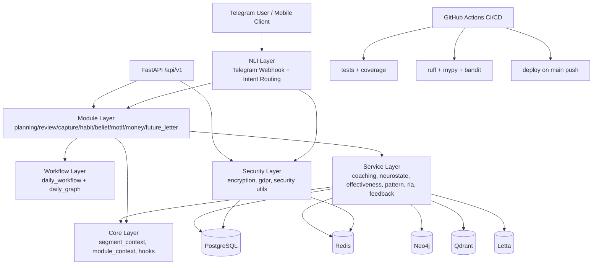

# Audit Report
- **Datum:** 2026-02-15
- **Modell:** gpt-5-codex
- **Modus:** Read-Only Analysis
- **Projekt:** aurora-sun-v1

## Methodik & Scope
- Analysemodus: Read-only (kein Code-Fix, kein Refactor, keine Config-Änderung).
- Analysiert wurden Repository-Struktur, Source, Tests, CI/CD, Docker/Monitoring, Security/Dependency-Tooling.
- Dateiscope: 221 Dateien im Repo (`rg --files | wc -l`), davon 103 Python-Quellfiles in `src/`.
- Ausgeführte Prüfungen: `pytest` + Coverage, `ruff`, `mypy --strict`, `bandit`, statische Metrik-Skripte (Komplexität/Importgraph/TODO-Dichte/Dependency-Nutzung).
- Externe Vulnerability-Feeds (`pip-audit`/`safety`) waren durch Umgebung eingeschränkt (siehe Blocker).

---

## PHASE 0: Reconnaissance

### 0.1 Projektprofil
- Primäre Sprache: Python 3.11+ (Runtime lokal: 3.14.0)
- Framework: FastAPI (REST), python-telegram-bot (Webhook/Bot)
- ORM/Migration: SQLAlchemy + Alembic
- Package Manager/Build: `pip` + `pyproject.toml` (setuptools)
- Teststack: pytest, pytest-asyncio, pytest-cov
- Lint/Typing/SAST: Ruff, mypy (strict), Bandit
- Infra: Docker Compose (Postgres, Redis, Neo4j, Qdrant, Letta, Monitoring)
- CI/CD: GitHub Actions (`.github/workflows/ci.yml`)

### 0.2 Schlüsseldateien gelesen
- `README.md`, `CHANGELOG.md`, `.env.example`, `.gitignore`
- `pyproject.toml`, `Dockerfile`, `docker-compose.prod.yml`
- `.github/workflows/ci.yml`, `migrations/env.py`, `main.py`
- `monitoring/*.yml`, `scripts/*.sh`
- `ARCHITECTURE.md`, `ROADMAP.md`, `TODO.md`, `docs/*` inkl. `docs/archive/*`

### 0.3 Architektur-Map (Mermaid)


### 0.4 Tech Stack Summary
| Bereich | Technologie | Version/Quelle |
|---|---|---|
| Runtime | Python | `>=3.11` (`pyproject.toml`), lokal `3.14.0` |
| API | FastAPI | `0.115.6` |
| ASGI | Uvicorn | `0.34.0` |
| Bot | python-telegram-bot | `21.10` |
| ORM | SQLAlchemy | `2.0.36` |
| Migration | Alembic | `1.14.1` |
| DB Driver | asyncpg | `0.30.0` |
| Cache | Redis client | `5.2.1` |
| Crypto | cryptography / PyJWT / keyring | `42.0.8` / `2.9.0` / `25.5.0` |
| Validation | Pydantic | `2.10.4` |
| HTTP | httpx | `0.28.1` |
| Logging | structlog | `24.4.0` |
| AI SDKs | anthropic/openai/groq | `0.43.0` / `1.59.6` / `0.13.1` |
| Orchestration AI | langgraph / dspy-ai / pydantic-ai | `0.2.62` / `2.5.43` / `0.0.39` |
| Vector/Graph/Memory | qdrant-client / neo4j / letta-client | `1.12.1` / `5.27.0` / `0.6.5` |
| Observability | prometheus-client / langfuse | `0.21.1` / `2.58.2` |
| Tests | pytest/pytest-asyncio/pytest-cov | `8.3.4` / `0.24.0` / `6.0.0` (declared) |
| Static analysis | ruff/mypy/bandit | `0.8.4` / `1.13.0` / `1.8.2` (declared) |
| Container DB | postgres | `16-alpine` |
| Container cache | redis | `7-alpine` |
| Container graph/vector | neo4j/qdrant/letta | `5.15-community` / `v1.7.4` / `latest` |
| Monitoring containers | prometheus/grafana/alertmanager etc. | mehrere `latest` tags |

### 0.5 Tooling-Blocker
| Tool | Status | Blocker |
|---|---|---|
| `pip-audit` | nicht verwertbar | versucht `pip` im temp-venv zu upgraden und bricht ab |
| `safety` | nicht verwertbar | kein Zugriff auf Remote-Server (Netzwerkrestriktion) |
| Outdated-Check | unvollständig | externe Paketindex-Abfragen in dieser Umgebung eingeschränkt |

---

## PHASE 1: Architecture Review

### 1.1 Projektstruktur
**Befund:** Die Schichten sind klar benannt (`src/api`, `src/modules`, `src/services`, `src/lib`, `src/infra`), aber Implementierungsreife ist uneinheitlich; API/Workflow enthalten zahlreiche Placeholders.

**Problem → Impact → Empfehlung**
- Problem: API-Routen sind weitgehend Scaffold und liefern statische Antworten (`src/api/routes.py:200`, `src/api/routes.py:218`, `src/api/routes.py:234`, `src/api/routes.py:404`).
  Impact: System wirkt funktional, ist aber für produktive API-Nutzung nicht funktionsbereit.
  Empfehlung: Priorisierte Implementierung der Top-Endpoints (Auth, Vision/Task CRUD, Transactions) inkl. Persistenz.
- Problem: Daily Workflow orchestriert TODO-Stubs statt echter Ausführung (`src/workflows/daily_workflow.py:400-402`, `src/workflows/daily_graph.py:404`, `src/workflows/daily_graph.py:433`, `src/workflows/daily_graph.py:552`).
  Impact: Core-Produktversprechen (vision→plan→review) ist nur teilweise real.
  Empfehlung: End-to-End Workflow-Pfade in einer sprintbaren Sequenz schließen (Persistenz, Planner, Review Hook).

### 1.2 Separation of Concerns
- Positiv: Importgraph hat keine Zyklen (103 Module, 182 Edges, 0 Zyklen).
- Risiko: Fachlogik, Sicherheitslogik und Stubs koexistieren in großen Modulen (`src/modules/money.py`, `src/lib/gdpr.py`, `src/lib/security.py`), was Wartbarkeit und Reviewability verschlechtert.

### 1.3 Dependency Graph
- Keine zyklischen Imports entdeckt.
- Hohe Fan-In Knoten: `src.core.segment_context` (23), `src.lib.encryption` (20), `src.models.base` (20), `src.lib.security` (15).
- Hohe Fan-Out Knoten: `src.modules.second_brain` (9), `src.modules.money` (7), `src.modules.review` (7), `src.workflows.daily_workflow` (7).

**Bewertung:** Strukturell sauberer als viele Projekte dieser Größe, aber mit zentralisierten Risiko-Modulen.

### 1.4 Data Flow
- Flow ist nachvollziehbar: Bot/API → Module → Services → Datenstores.
- State-Layer stark gemischt: in-memory dicts + DB + Redis (siehe `src/modules/money.py:816-822`, `src/services/crisis_service.py:329-331`, `src/services/revenue_tracker.py:222`).
- Boundaries sind vorhanden, aber bei GDPR/Export/Delete oft nur als Platzhalter.

### 1.5 API Design
- Versionierung vorhanden: `/api/v1` (`src/api/routes.py:115`).
- Konsistenzproblem: Response-Schemata uneinheitlich und häufig Placeholder.
- AuthN/AuthZ unvollständig: `/auth/token` liefert bewusst `501` (`src/api/routes.py:177-181`), detaillierter Health-Check nur pseudo-auth via `user_id` Query (`src/api/routes.py:152-154`).

### 1.6 State Management
- Positiv: SegmentContext/ModuleContext gut abstrahiert.
- Negativ: Produktionskritische Datenpfade teils in-memory statt persistent.

### 1.7 Architektur-Snippets (konkrete Belege)
```python
# src/api/routes.py:152-154
# TODO: Add actual authentication/admin role check via middleware
if user_id is None:
    return {"error": "Authentication required"}
```

```python
# src/workflows/daily_workflow.py:400-402
# TODO: Run through LangGraph (daily_graph.py)
# For now, we'll use this as the orchestrator
# The actual graph execution will be in daily_graph.py
```

```python
# src/workflows/daily_graph.py:552-556
# TODO: Save DailyPlan to database
# await save_daily_plan(state)

# TODO: Feed Aurora narrative
# await feed_aurora_summary(state)
```

---

## PHASE 2: Code Quality Analysis

### 2.1 Quantitative Qualitätssignale
- `src` LOC: 44,727
- Funktionen >50 LOC: 118
- Funktionen mit Nesting >3: 44
- Funktionen mit geschätzter CC >=12: 19
- `except Exception` Vorkommen: 95
- TODO/FIXME/HACK in `src/tests/migrations/main.py`: 74 (davon 74 in `src`)

### 2.2 Datei- und Modul-Risiken (Top)
| Datei | Funktionen | >50 LOC | Nesting >3 | CC>=12 | Einschätzung |
|---|---:|---:|---:|---:|---|
| `src/modules/money.py` | 35 | 5 | 3 | 4 | Hoch: God-Module + fachkritische Finanzlogik |
| `src/modules/onboarding_deep.py` | 7 | 5 | 5 | 0 | Hoch: tiefe Verschachtelung, schwer testbar |
| `src/lib/encryption.py` | 31 | 3 | 1 | 2 | Hoch: zentrale Security-Logik mit komplexen Pfaden |
| `src/lib/gdpr.py` | 27 | 2 | 2 | 2 | Hoch: breite Zuständigkeit + viele Exception-Pfade |
| `src/services/effectiveness.py` | 19 | 5 | 0 | 1 | Mittel/Hoch: breit, aber gut getestet |
| `src/bot/onboarding.py` | 19 | 2 | 2 | 2 | Mittel/Hoch: State-Machine-Komplexität |
| `src/infra/backup.py` | 13 | 5 | 1 | 0 | Mittel/Hoch: operative Kritikalität |
| `src/infra/health.py` | 11 | 5 | 1 | 0 | Mittel/Hoch: Betriebsstabilität |

### 2.3 Kritische Komplexitäts-Hotspots (Auszug)
| Funktion | Datei:Zeile | LOC | gesch. CC | Nesting |
|---|---|---:|---:|---:|
| `delete_user_data` | `src/lib/gdpr.py:375` | 128 | 23 | 2 |
| `handle_update` | `src/bot/webhook.py:147` | 95 | 20 | 3 |
| `calculate_readiness` | `src/agents/aurora/proactive.py:152` | 122 | 18 | 4 |
| `detect_patterns` | `src/modules/money.py:680` | 88 | 18 | 3 |
| `_get_user_salt` | `src/lib/encryption.py:319` | 94 | 17 | 3 |
| `_send_prompt` | `src/bot/onboarding.py:523` | 84 | 17 | 5 |

### 2.4 Code Smells
**God Modules / God Functions**
- `src/modules/money.py` (1563 LOC)
- `src/lib/encryption.py` (1062 LOC)
- `src/lib/security.py` (1043 LOC)
- `src/lib/gdpr.py` (979 LOC)

**Copy-Paste / DRY-Verletzungen (konkret)**
- Wiederholte GDPR-Stubs über Module (`export/delete/freeze/unfreeze`) u.a.:
  - `src/modules/planning.py:322-358`
  - `src/modules/second_brain.py:596-616`
  - `src/modules/capture.py:615-655`
  - `src/modules/habit.py:328-350`
  - `src/modules/future_letter.py:347-368`
  - `src/modules/motif.py:384-394`
- Wiederholte Encrypted-Property-Pattern in Modellen (`goal/task/vision/user/neurostate`).

**Magic Values (Beispiele)**
- Finanzparser: hartkodierte Keyword/Regex-Listen (`src/modules/money.py:508-538`).
- Security/Rate-Limits in mehreren Dateien teilweise ohne zentrale Policy.

### 2.5 Naming & Readability
- Positiv: Naming meist konsistent, Typen klar, viele Docstrings.
- Negativ: `FINDING-*` Kommentare im Produktivcode als dauerhafte Marker reduzieren Lesbarkeit und signalisieren offene Umbauten.

### 2.6 Dead Code / Unfertige Pfade
- Statischer Lint zeigt derzeit keine ungenutzten Imports/Variablen in `src` (Ruff meldet nur 1 Import-Order-Fehler).
- Funktional „toter“/nicht erreichter Produktpfad durch Platzhalter:
  - API Placeholders (`src/api/routes.py` vielfach)
  - NLI-Routing-Stub (`src/bot/webhook.py:352-355`)
  - Workflow TODO-Nodes (`src/workflows/daily_graph.py:404+`)

### 2.7 Snippets
```python
# src/bot/webhook.py:352-355
# TODO: Implement actual NLI routing
# For now, just echo back (scaffold)
response_text = f"Echo: {message_text}"
```

```python
# src/modules/planning.py:337-358
# TODO: Implement actual deletion from database
pass
# TODO: Mark user data as restricted
pass
# TODO: Remove restriction flag
pass
```

---

## PHASE 3: Dependency & Security Audit

### 3.1 Dependency Audit
- `bandit -r src -f json -l`: 7 Low-Findings, 0 Medium/High.
- `ruff check`: 1 Finding (`migrations/env.py` Importsortierung).
- `mypy --strict src`: 0 Fehler.
- `pip check`: keine Broken-Requirements.
- `pip-audit`: in dieser Umgebung nicht valide ausführbar.
- `safety`: Netzwerkzugriff auf Vulnerability-Service fehlgeschlagen.

### 3.2 Bekannte Schwachstellen / Risiken
| Severity | Finding | Datei/Zeile | Impact |
|---|---|---|---|
| 🔴 Critical | REST-API Auth/AuthZ nicht wired; sensitive endpoints via unverified `user_id` Parameter nutzbar | `src/api/routes.py:138-154`, `src/api/routes.py:163-181` | Unautorisierter Zugriff auf API-Pfade möglich, sobald echte Daten angebunden werden |
| 🔴 Critical | Security-Middleware vorhanden, aber in API-App nicht registriert | `src/lib/security.py:1011-1042`, `src/api/__init__.py:40-88` | HTTP-Header-/Rate-Policy greifen nicht zwingend zentral für FastAPI |
| 🔴 Critical | Webhook-Secret optional; ohne Secret wird Request akzeptiert | `src/bot/webhook.py:103-114`, `src/bot/webhook.py:397-402` | Spoofing-Risiko bei Fehlkonfiguration |
| 🟠 High | Finanzdaten fallen bei Encryption-Fehler auf Klartext-Fallback | `src/modules/money.py:1168-1172` | Verlust von Vertraulichkeit in Fehlerszenarien |
| 🟠 High | Insecure Fallback-Key für HMAC-Integrität im RIA-Service | `src/services/ria_service.py:292-297` | Integritätsnachweise verwässern bei fehlender Key-Config |
| 🟠 High | GDPR-Delete/Freeze häufig Stub (`pass`) statt wirksame Löschung | mehrere Module, z.B. `src/modules/capture.py:629-655` | Compliance- und Rechtsrisiko (Art. 17/18 nicht durchgängig erfüllt) |
| 🟡 Medium | Monitoring Stack nutzt `latest`-Images | `docker-compose.prod.yml:194`, `216`, `240`, `261`, `281`, `300`, `320` | Reproduzierbarkeit und Patchkontrolle reduziert |
| 🟡 Medium | Monitoring Ports breit auf Host exponiert | `docker-compose.prod.yml:201-327` | Größere Angriffsfläche |
| 🔵 Low | Bandit meldet 7 Low (u.a. try/except/pass, Assert in Runtime, heuristische false positives) | u.a. `src/lib/encryption.py:810`, `src/modules/review.py:155` | Wartbarkeits-/Hardening-Thema, kein akuter Exploitindikator |

### 3.3 Hardcoded Secrets / Key Hygiene
- Keine offensichtlichen Real-Secrets im Arbeitsbaum entdeckt.
- Placeholder in Monitoring-Konfiguration:
  - `monitoring/alertmanager.yml:6` (`PLACEHOLDER_PASSWORD`)
- `.env` ist in `.gitignore` vorhanden (`.gitignore` enthält `.env`).

### 3.4 SQLi/XSS/Input/Deserialization/CORS
- SQL: überwiegend parameterisierte Queries (`text(..., :user_id)` in `src/lib/gdpr.py:638+`, SQLAlchemy statements).
- XSS/Input: Sanitizer vorhanden (`src/lib/security.py`), aber nicht zentral über alle Entry-Points garantiert.
- Unsafe Deserialization: keine kritischen Muster (`pickle.loads`/`eval`) im Scan gefunden.
- CORS: restriktiver Default (leer), konfigurierbar via `AURORA_CORS_ORIGINS` (`src/api/__init__.py:54-67`).

### 3.5 Secrets in Git History (soweit prüfbar)
- Schneller Commit-Pattern-Check durchgeführt; keine eindeutige harte Secret-Exfiltration nachweisbar.
- Einschränkung: kein vollständiges forensisches Secret-Scanning über alle historischen Blob-Inhalte.

### 3.6 Security-Snippets
```python
# src/bot/webhook.py:103-107
expected_secret = os.environ.get("TELEGRAM_WEBHOOK_SECRET")
if expected_secret:
    if not secret_header or not hmac.compare_digest(secret_header, expected_secret):
        return False
```

```python
# src/modules/money.py:1168-1172
except EncryptionServiceError:
    logger.warning("money_transaction_encryption_failed")
    amount_enc = json.dumps({"plaintext_fallback": str(parsed_data["amount"])})
    desc_enc = json.dumps({"plaintext_fallback": parsed_data.get("description", "")})
```

```python
# src/services/ria_service.py:293-297
if not key_material:
    _logging.getLogger(__name__).warning(
        "AURORA_MASTER_KEY not set; using insecure fallback for cycle log HMAC"
    )
    key_material = "dev-only-insecure-key"
```

---

## PHASE 4: Test Audit

### 4.1 Testlauf (voll)
**Command:** `PYTHONPATH=. pytest tests -p no:cacheprovider --cov=src --cov-report=term`

- Collected: **2701**
- Passing: **2692**
- Failing: **6**
- Skipped: **3**
- Coverage: **86%** (`12841 stmts, 1740 miss`)
- Laufzeit: **19.36s** (pytest), **22.206s** wall clock (`time`)
- Warnings: **193**

### 4.2 Failing Tests + Root Cause
| Test | Beobachtung | Root Cause Einschätzung |
|---|---|---|
| `test_rotate_key` | Erwartet `DecryptionError` nach `rotate_key`, tritt nicht ein | **Code/Test-Mismatch** (Semantik von Key-Rotation vs Testerwartung) |
| `test_full_user_data_lifecycle` | `EncryptionServiceError` wegen nicht speicherbarer Salt-Datei | **Umgebungskonfiguration** (unwritable default salt path) |
| `test_multiple_users_isolated` | wie oben | **Umgebungskonfiguration** |
| `test_transaction_amount_encrypted` | Klartext-Fallback statt ciphertext | **Folgefehler durch Salt-Persistenzproblem** |
| `test_encrypted_amount_decrypts_correctly` | wie oben | **Folgefehler durch Salt-Persistenzproblem** |
| `test_description_encrypted` | wie oben | **Folgefehler durch Salt-Persistenzproblem** |

**Validierung:** Mit `AURORA_SALT_DIR=/tmp/aurora-audit-salts` laufen 5/6 dieser Tests durch; nur `test_rotate_key` bleibt rot.

### 4.3 Testqualität
- Stärken: sehr breite Suite (2701 Tests), guter Coverage-Wert für frühen Produktstatus.
- Schwächen:
  - Einige Tests sind stark umgebungsabhängig (Dateisystem-Salt-Persistenz).
  - Hohe Warnungszahl (deprecated `datetime.utcnow`, async fixture/mock warnings).
  - Teilweise fragile Setup-Muster (`_ReusableAwait` in Tests, laut Warnungen).

### 4.4 Coverage Gaps (kritische Pfade, nach Risiko)
| Risiko | Datei | Coverage | Relevanz |
|---|---|---:|---|
| Hoch | `src/api/__init__.py` | 43% | Entry-Point/API-Konfiguration |
| Hoch | `src/lib/security.py` | 65% | zentrale Input-/Header-/Rate-Security |
| Hoch | `src/models/neurostate.py` | 70% | neurostate-basierte Coaching-Entscheidungen |
| Hoch | `src/lib/gdpr.py` | 73% | Datenschutzexport/-löschung |
| Hoch | `src/services/knowledge/neo4j_service.py` | 68% | Knowledge-Layer, Querypfade |
| Hoch | `src/bot/onboarding.py` | 68% | Consent-/Onboarding-State |
| Mittel | `src/services/knowledge/qdrant_service.py` | 73% | semantische Suche |
| Mittel | `src/modules/onboarding_deep.py` | 74% | sensible Nutzerführung |
| Mittel | `src/infra/backup.py` | 79% | Betriebsresilienz |
| Mittel | `src/infra/health.py` | 77% | Monitoring-/Health-Signale |

---

## PHASE 5: Error Handling & Resilience

### 5.1 Error Handling Patterns
- Muster ist inkonsistent: sowohl saubere Log+Fallback-Pfade als auch breite `except Exception` Blöcke.
- Quantitativ: 95x `except Exception` im `src`.
- `try/except/pass` vorhanden (Bandit B110):
  - `src/lib/encryption.py:810-811`
  - `src/lib/encryption.py:848-849`
  - `src/services/coaching_engine.py:579-580`

### 5.2 Logging
- Positiv: strukturierte Logs teilweise vorhanden, `hash_uid` wird genutzt.
- Negativ: Logging-Strategie nicht konsistent über alle Module (Mischung stdlib logging + structlog).
- Risiko: vereinzeltes Logging von `str(e)` in Middleware (`src/infra/middleware.py:511`) kann intern Details enthalten.

### 5.3 Graceful Degradation
- Teilweise vorhanden (z.B. Fallbacks), aber teils fachlich riskant (Klartext-Fallback bei Encryption-Fehler).
- Retry/Circuit-Breaker nicht durchgängig an externe Schnittstellen integriert.
- In-Memory Stores bei kritischen Services sind für echte Ausfälle nur begrenzt resilient.

---

## PHASE 6: DevX & Maintenance

### 6.1 Onboarding-Test (<30 Min?)
**Einschätzung:** Teilweise, aber nicht ohne Stolpersteine.
- Positiv: README enthält Setup-Basics, `.env.example` ist vorhanden.
- Blocker:
  - README Dev-Start verweist auf nicht existierendes ASGI-Objekt (`uvicorn src.bot.webhook:app`) statt `main:app`.
  - Siehe `README.md:43` vs `main.py:21`.

### 6.2 CI/CD
- Pipeline vorhanden mit Test, Lint, Typing, Bandit, Coverage-Gate, Docker-Build, Deploy.
- Widerspruch Doku vs CI:
  - README: „Deployments are NEVER automatic“ (`README.md:96`)
  - CI: automatischer Deploy auf `main` push (`.github/workflows/ci.yml:191`).

### 6.3 Type Safety
- `mypy --strict` auf `src` erfolgreich (0 Fehler).
- Typdisziplin ist insgesamt gut für Projektgröße.

### 6.4 Konfiguration
- Gute Basis via `.env.example`.
- Mehrere sicherheitskritische Defaults/Fallbacks sollten fail-closed sein (Webhook secret, RIA HMAC key fallback).

### 6.5 Git Hygiene
- Commit-Historie aktiv und thematisch verständlich.
- Branch-Trigger in CI: `main`, `dev`, `claude/*`.

---

## PHASE 7: Project Maturity Assessment

**Einstufung: 🟡 Growing**

**Begründung (Evidence):**
- Pluspunkte: große Testsuite (2701), Coverage 86%, strikte Typprüfung, CI-Pipeline vorhanden.
- Minuspunkte: produktionskritische Pfade noch stubbed (API/Workflow/GDPR), Auth/AuthZ nicht durchgängig wired, Security-Fail-open-Szenarien.
- Fazit: solide technische Basis, aber noch keine durchgehend production-grade End-to-End-Umsetzung.

---

## PHASE 8: Quality Scorecard

| Kategorie | Score | Gewicht | Gewichtet |
|---|---:|---:|---:|
| Architecture & Design | 68 | 20% | 13.6 |
| Code Quality | 64 | 20% | 12.8 |
| Test Coverage & Quality | 81 | 15% | 12.15 |
| Security | 62 | 15% | 9.3 |
| Error Handling & Resilience | 58 | 10% | 5.8 |
| Dependencies & Maintenance | 55 | 10% | 5.5 |
| Documentation & DevX | 60 | 5% | 3.0 |
| Performance | 57 | 5% | 2.85 |
| **TOTAL** |  |  | **65.0 / 100** |

### 8.1 Kategoriebegründungen + Top Issues + Empfehlungen

#### Architecture & Design (68/100)
1-Satz-Begründung: Schichtenmodell und Importgraph sind strukturell gut, aber zentrale End-to-End-Flows sind noch nicht fertig verdrahtet.
Top 3 Issues:
- API Placeholders statt Persistenzlogik (`src/api/routes.py:200`, `src/api/routes.py:404`).
- Daily workflow nodes als TODO-Stubs (`src/workflows/daily_graph.py:404`, `src/workflows/daily_graph.py:552`).
- In-memory State für kritische Datenpfade (`src/modules/money.py:816-822`).
Top 3 Empfehlungen:
- API-MVP-Endpunkte vollständig implementieren (Auth, Vision/Task, Transactions).
- Daily Graph End-to-End mit DB-Persistenz schließen.
- In-memory Runtime-State für kritische Domänen in DB/Redis persistieren.

#### Code Quality (64/100)
1-Satz-Begründung: Lesbarkeit ist ordentlich, aber hohe Komplexität konzentriert sich in einigen zentralen Modulen.
Top 3 Issues:
- 118 Funktionen >50 LOC (u.a. `src/lib/gdpr.py:375`).
- 95 breite `except Exception` Blöcke.
- Hohe TODO-Dichte in produktnahen Modulen (`src/workflows/daily_graph.py`, `src/modules/planning.py`).
Top 3 Empfehlungen:
- Top-10 Komplexitätsfunktionen in kleinere Units splitten.
- Exception-Hierarchie einführen und broad catches reduzieren.
- TODOs in Roadmap-Issues überführen, Stubs explizit feature-flaggen.

#### Test Coverage & Quality (81/100)
1-Satz-Begründung: Sehr gute quantitative Abdeckung, aber Qualitätsrisiken durch Umgebungsabhängigkeit und Warnungsflut.
Top 3 Issues:
- 6 failing tests (davon 5 env-abhängig).
- 193 Warnings (Deprecations/Async-Mocks).
- Kritische Coverage-Lücken in Security/API/Knowledge-Pfaden.
Top 3 Empfehlungen:
- Test-Env für Salt-Persistenz standardisieren (`AURORA_SALT_DIR` fixture).
- Warning-Budget in CI einführen.
- Zielgerichtete Tests für `src/lib/security.py`, `src/api/__init__.py`, Knowledge Services erweitern.

#### Security (62/100)
1-Satz-Begründung: Gute Security-Bausteine vorhanden, aber zentrale Durchsetzungslücken (Auth, Middleware-Wiring, Fail-open Verhalten).
Top 3 Issues:
- Auth/AuthZ in API nicht wirksam (`src/api/routes.py:152`).
- Webhook-Secret optional (`src/bot/webhook.py:397-402`).
- Klartext-Fallback in Finanzverschlüsselung (`src/modules/money.py:1168-1172`).
Top 3 Empfehlungen:
- API-weit verpflichtende AuthN/AuthZ-Dependencies.
- Webhook fail-closed bei fehlendem Secret.
- Encryption-Failure als hard error mit retriable queue statt plaintext fallback.

#### Error Handling & Resilience (58/100)
1-Satz-Begründung: Teilweise robust, aber in kritischen Pfaden zu viele breite/schluckende Exception-Muster.
Top 3 Issues:
- `try/except/pass` in Security-kritischen Bereichen (`src/lib/encryption.py:810`).
- In-memory state in crisis/revenue ohne durable fallback.
- Retry/Circuit-Breaker nicht konsistent angebunden.
Top 3 Empfehlungen:
- `except Exception` durch zielgerichtete Exceptions ersetzen.
- Persistenz und Recovery-Pfade für in-memory Stores ergänzen.
- Retry/Circuit-Breaker systematisch für externe Abhängigkeiten aktivieren.

#### Dependencies & Maintenance (55/100)
1-Satz-Begründung: Versionspinning ist positiv, aber dependency-vuln/outdated Transparenz ist wegen Tooling-Limits nicht abgesichert und mehrere Images laufen auf `latest`.
Top 3 Issues:
- `pip-audit`/`safety` nicht verwertbar in aktueller Umgebung.
- Monitoring-Container auf `latest`.
- Potenziell ungenutzte AI-Dependencies (statische Analyse).
Top 3 Empfehlungen:
- Reproduzierbaren Dependency-Scan in CI mit network-enabled runner aufsetzen.
- Container-Tags pinnen (Semver/digest).
- Unused deps via periodic import-usage + runtime tracing konsolidieren.

#### Documentation & DevX (60/100)
1-Satz-Begründung: Umfangreiche Doku vorhanden, aber relevante Teile sind inkonsistent oder veraltet.
Top 3 Issues:
- README Startkommando falsch (`README.md:43` vs `main.py:21`).
- README „Known Limitations“ veraltet (`README.md:104-106` vs realer Stand).
- Deploy-Aussage im README widerspricht CI (`README.md:96` vs `.github/workflows/ci.yml:191`).
Top 3 Empfehlungen:
- README als „executable doc“ mit CI-checkbarem Quickstart.
- Release-/Docs-Drift Check in CI.
- Architektur- und Statusdoku automatisch aus Source-of-Truth ableiten.

#### Performance (57/100)
1-Satz-Begründung: Offensichtliche Bottlenecks sind eher strukturell (große Module, in-memory patterns), nicht akut gemessene Runtime-Hotspots.
Top 3 Issues:
- Große Monolith-Module (`money.py`, `gdpr.py`, `security.py`).
- Mehrfacharbeit in Workflow-/Module-Pfaden mit TODO-Stubs.
- Potenzieller Speicheranstieg bei in-memory Sammlungen.
Top 3 Empfehlungen:
- Modularisierung und klare Hot-path Profilerstellung.
- Cache-/Persistenzstrategie vereinheitlichen.
- Lasttests für webhook/API in CI integrieren.

---

## PHASE 9: Executive Summary

### 9.1 TL;DR (3 Sätze)
Das Projekt hat eine starke technische Basis mit hoher Testanzahl, solider Coverage und striktem Typchecking. Die größte Lücke liegt nicht in Basistechnik, sondern in unvollständig verdrahteten produktionskritischen Pfaden (Auth, Workflow-Ende-zu-Ende, GDPR-Operationen, Fail-closed Security). Für Production-Grade fehlen vor allem konsequente Security-Durchsetzung, Persistenz-Vollständigkeit und Dokumentationskonsistenz.

### 9.2 Project Maturity
**🟡 Growing** – gute Fundamentqualität, aber noch nicht durchgehend produktionsreif in den Kernpfaden.

### 9.3 Gesamtscore
**65.0 / 100**

### 9.4 🔴 Critical Issues (sofort handeln)
| Issue | Datei | Impact |
|---|---|---|
| API Auth/AuthZ nicht wirksam | `src/api/routes.py:138-181` | Potenziell unautorisierte API-Nutzung bei echten Daten |
| Security-Middleware nicht zentral wired | `src/lib/security.py:1011-1042`, `src/api/__init__.py:40-88` | Schutzmechanismen nicht garantiert aktiv |
| Webhook fail-open ohne Secret | `src/bot/webhook.py:103-114`, `src/bot/webhook.py:397-402` | Request-Spoofing Risiko |

### 9.5 🟠 High Priority (nächster Sprint)
| Issue | Datei | Impact |
|---|---|---|
| Klartext-Fallback bei Encryption-Fehler | `src/modules/money.py:1168-1172` | Vertraulichkeitsverletzung in Fehlerszenarien |
| Insecure HMAC fallback key | `src/services/ria_service.py:292-297` | Integritätsgarantien geschwächt |
| GDPR-Delete/Freeze als Stubs | mehrere `src/modules/*` | Compliance-Risiko |
| Workflow Kernknoten als TODO | `src/workflows/daily_graph.py:404+` | Produktfluss unvollständig |
| README/CI Deploy-Widerspruch | `README.md:96`, `.github/workflows/ci.yml:191` | Operatives Fehlverständnis |

### 9.6 🟡 Medium Priority (Backlog)
| Issue | Datei | Impact |
|---|---|---|
| Monitoring images auf `latest` | `docker-compose.prod.yml:194+` | Reproduzierbarkeit/Patch-Tracking |
| Monitoring-Ports breit exponiert | `docker-compose.prod.yml:201-327` | Angriffsfläche |
| Hohe `except Exception` Dichte | `src/**` | Diagnostik-/Wartungsrisiko |
| Deprecation-/Async-Warnings in Tests | `tests/**` | zukünftige Stabilitätsrisiken |
| Coverage-Gaps in Security/API/Knowledge | diverse | erhöhte Regressionswahrscheinlichkeit |

### 9.7 Recommended Roadmap (Top 10, priorisiert)
| Priorität | Action | Aufwand |
|---|---|---|
| 1 | API-weit AuthN/AuthZ Dependencies + echte Tokenausgabe einführen | M |
| 2 | Webhook fail-closed erzwingen, Secret mandatory in prod | S |
| 3 | Security-Middleware zentral in FastAPI-App mounten | S |
| 4 | Klartext-Fallback in Money entfernen; sichere Retry-/Errorstrategie | M |
| 5 | Daily Graph TODO-Nodes (Plan/Review/Persistenz) vollständig implementieren | L |
| 6 | GDPR export/delete/freeze in allen Modulen produktiv anbinden | L |
| 7 | RIA HMAC fallback key entfernen; hard-fail bei fehlender Key-Config | S |
| 8 | README/Runbook/CI-Policy konsolidieren (ein Source of Truth) | S |
| 9 | Monitoring Container-Versionen pinnen + Port-Exposure reduzieren | M |
| 10 | Testhygiene: Warning-Budget + env-stabile Encryption-Tests | M |

### 9.8 Stärken des Projekts (mind. 3)
- Sehr breite Testbasis (2701 Tests) mit insgesamt gutem Coverage-Level (86%).
- Strikte Typprüfung (`mypy --strict`) ohne Fehler über 103 Source-Dateien.
- Klare modulare Zielarchitektur mit zyklusfreiem Importgraph und sauberer Layer-Struktur.
- Gute Security-Bausteine bereits vorhanden (Encryption, Consent/GDPR-Struktur, Sanitization, Rate-Limiter).

---

## Appendix A: Reproduzierbare Kernbefehle
```bash
PYTHONPATH=. pytest tests -p no:cacheprovider --cov=src --cov-report=term
PYTHONPATH=. AURORA_SALT_DIR=/tmp/aurora-audit-salts pytest -q \
  tests/src/lib/test_encryption.py::TestEncryptionService::test_rotate_key \
  tests/src/lib/test_encryption.py::TestEncryptionIntegration::test_full_user_data_lifecycle \
  tests/src/lib/test_encryption.py::TestEncryptionIntegration::test_multiple_users_isolated \
  tests/src/modules/test_money.py::TestEncryption::test_transaction_amount_encrypted \
  tests/src/modules/test_money.py::TestEncryption::test_encrypted_amount_decrypts_correctly \
  tests/src/modules/test_money.py::TestEncryption::test_description_encrypted
ruff check src tests migrations main.py
PYTHONPATH=. mypy src --strict
bandit -r src -f json -l
coverage report -m
```

## Appendix B: Beispielbelege (Datei + Zeile)
- `src/api/routes.py:152-154` (Pseudo-Auth)
- `src/bot/webhook.py:103-114` (Webhook Secret optional)
- `src/modules/money.py:1168-1172` (plaintext fallback)
- `src/services/ria_service.py:292-297` (insecure fallback key)
- `src/workflows/daily_graph.py:404`, `:433`, `:552` (TODO Kernknoten)
- `README.md:43` vs `main.py:21` (falsches Startkommando)
- `README.md:96` vs `.github/workflows/ci.yml:191` (Deploy-Widerspruch)

## Appendix C: Vollständige Komplexitätslisten

### C.1 Funktionen >50 LOC (vollständig)
- `src/agents/aurora/agent.py:141` `run_weekly_cycle` | LOC=62 | CC~8 | Nesting=0
- `src/agents/aurora/coherence.py:164` `audit_coherence` | LOC=77 | CC~7 | Nesting=1
- `src/agents/aurora/coherence.py:242` `find_contradictions` | LOC=54 | CC~8 | Nesting=4
- `src/agents/aurora/coherence.py:439` `_detect_gaps` | LOC=61 | CC~6 | Nesting=2
- `src/agents/aurora/growth.py:249` `calculate_trajectory` | LOC=90 | CC~6 | Nesting=2
- `src/agents/aurora/growth.py:490` `_generate_narrative` | LOC=61 | CC~4 | Nesting=2
- `src/agents/aurora/milestones.py:91` `check_milestones` | LOC=70 | CC~14 | Nesting=3
- `src/agents/aurora/milestones.py:289` `detect_habit_established` | LOC=60 | CC~5 | Nesting=1
- `src/agents/aurora/narrative.py:282` `create_chapter` | LOC=72 | CC~8 | Nesting=1
- `src/agents/aurora/proactive.py:152` `calculate_readiness` | LOC=122 | CC~18 | Nesting=4
- `src/agents/avicenna/agent.py:289` `get_health_report` | LOC=58 | CC~1 | Nesting=0
- `src/agents/avicenna/agent.py:352` `tracked` | LOC=83 | CC~7 | Nesting=2
- `src/agents/avicenna/agent.py:369` `decorator` | LOC=65 | CC~7 | Nesting=2
- `src/agents/avicenna/agent.py:371` `wrapper` | LOC=61 | CC~7 | Nesting=2
- `src/agents/avicenna/tracker.py:204` `track_transition` | LOC=79 | CC~6 | Nesting=1
- `src/agents/tron/agent.py:290` `get_security_report` | LOC=73 | CC~6 | Nesting=1
- `src/agents/tron/compliance.py:118` `check_retention_compliance` | LOC=67 | CC~9 | Nesting=2
- `src/agents/tron/compliance.py:186` `audit_consent` | LOC=72 | CC~12 | Nesting=3
- `src/agents/tron/compliance.py:259` `check_key_rotation` | LOC=54 | CC~4 | Nesting=2
- `src/agents/tron/compliance.py:314` `scan_vulnerabilities` | LOC=59 | CC~6 | Nesting=3
- `src/agents/tron/compliance.py:374` `generate_report` | LOC=54 | CC~7 | Nesting=3
- `src/agents/tron/threat_monitor.py:157` `detect_anomalies` | LOC=93 | CC~11 | Nesting=2
- `src/agents/tron/threat_monitor.py:292` `_create_threat` | LOC=63 | CC~6 | Nesting=3
- `src/api/__init__.py:28` `create_app` | LOC=61 | CC~2 | Nesting=1
- `src/bot/onboarding.py:405` `_handle_callback` | LOC=61 | CC~13 | Nesting=6
- `src/bot/onboarding.py:523` `_send_prompt` | LOC=84 | CC~17 | Nesting=5
- `src/bot/webhook.py:147` `handle_update` | LOC=95 | CC~20 | Nesting=3
- `src/i18n/strings.py:436` `t` | LOC=53 | CC~10 | Nesting=6
- `src/infra/backup.py:251` `backup_postgresql` | LOC=86 | CC~8 | Nesting=2
- `src/infra/backup.py:338` `backup_redis` | LOC=76 | CC~8 | Nesting=2
- `src/infra/backup.py:415` `backup_neo4j` | LOC=78 | CC~6 | Nesting=2
- `src/infra/backup.py:494` `backup_qdrant` | LOC=85 | CC~8 | Nesting=4
- `src/infra/backup.py:668` `restore_postgresql` | LOC=69 | CC~5 | Nesting=2
- `src/infra/health.py:163` `check_postgres` | LOC=70 | CC~7 | Nesting=3
- `src/infra/health.py:234` `check_redis` | LOC=70 | CC~7 | Nesting=3
- `src/infra/health.py:305` `check_neo4j` | LOC=72 | CC~9 | Nesting=4
- `src/infra/health.py:378` `check_qdrant` | LOC=68 | CC~7 | Nesting=3
- `src/infra/health.py:447` `check_letta` | LOC=68 | CC~7 | Nesting=3
- `src/infra/middleware.py:454` `log_request` | LOC=64 | CC~9 | Nesting=3
- `src/infra/rbac.py:297` `require_any_permission` | LOC=51 | CC~4 | Nesting=1
- `src/lib/encryption.py:239` `_load_master_key` | LOC=79 | CC~13 | Nesting=3
- `src/lib/encryption.py:319` `_get_user_salt` | LOC=94 | CC~17 | Nesting=3
- `src/lib/encryption.py:488` `encrypt_field` | LOC=54 | CC~7 | Nesting=2
- `src/lib/gdpr.py:375` `delete_user_data` | LOC=128 | CC~23 | Nesting=2
- `src/lib/gdpr.py:618` `_export_postgres` | LOC=75 | CC~6 | Nesting=3
- `src/lib/logging.py:21` `setup_logging` | LOC=56 | CC~3 | Nesting=1
- `src/lib/security.py:283` `sanitize_for_llm` | LOC=58 | CC~5 | Nesting=1
- `src/lib/security.py:580` `check_rate_limit` | LOC=77 | CC~9 | Nesting=2
- `src/models/consent.py:267` `create_consent_record` | LOC=75 | CC~7 | Nesting=1
- `src/models/consent.py:370` `validate_consent` | LOC=73 | CC~5 | Nesting=1
- `src/modules/belief.py:625` `_handle_track` | LOC=59 | CC~3 | Nesting=2
- `src/modules/capture.py:337` `route_content` | LOC=113 | CC~8 | Nesting=5
- `src/modules/capture.py:451` `_build_confirmation` | LOC=68 | CC~5 | Nesting=3
- `src/modules/habit.py:564` `_handle_tracking` | LOC=70 | CC~5 | Nesting=3
- `src/modules/money.py:542` `parse_transaction_from_nl` | LOC=66 | CC~12 | Nesting=3
- `src/modules/money.py:680` `detect_patterns` | LOC=88 | CC~18 | Nesting=3
- `src/modules/money.py:873` `handle` | LOC=51 | CC~6 | Nesting=1
- `src/modules/money.py:925` `_run_pipeline` | LOC=71 | CC~12 | Nesting=7
- `src/modules/money.py:1405` `export_user_data` | LOC=85 | CC~12 | Nesting=4
- `src/modules/motif.py:636` `_detect_motifs_from_text` | LOC=65 | CC~7 | Nesting=1
- `src/modules/onboarding_deep.py:103` `get_path_selection_prompt` | LOC=55 | CC~5 | Nesting=4
- `src/modules/onboarding_deep.py:159` `get_segment_prompt` | LOC=62 | CC~7 | Nesting=5
- `src/modules/onboarding_deep.py:222` `get_energy_pattern_prompt` | LOC=77 | CC~8 | Nesting=4
- `src/modules/onboarding_deep.py:300` `get_burnout_history_prompt` | LOC=81 | CC~8 | Nesting=4
- `src/modules/onboarding_deep.py:382` `get_completion_message` | LOC=80 | CC~11 | Nesting=5
- `src/modules/planning.py:174` `on_enter` | LOC=52 | CC~2 | Nesting=1
- `src/modules/planning.py:389` `_handle_vision` | LOC=60 | CC~4 | Nesting=2
- `src/modules/planning.py:479` `_handle_priorities` | LOC=71 | CC~5 | Nesting=3
- `src/modules/planning.py:580` `_handle_segment_check` | LOC=65 | CC~10 | Nesting=2
- `src/modules/planning.py:646` `_handle_commitment` | LOC=64 | CC~3 | Nesting=2
- `src/modules/review.py:286` `on_enter` | LOC=57 | CC~2 | Nesting=1
- `src/modules/second_brain.py:321` `_handle_capture` | LOC=56 | CC~3 | Nesting=1
- `src/modules/second_brain.py:430` `_route_content` | LOC=77 | CC~4 | Nesting=3
- `src/modules/second_brain.py:508` `_build_confirmation` | LOC=54 | CC~5 | Nesting=3
- `src/services/coaching_engine.py:159` `handle_stuck` | LOC=68 | CC~8 | Nesting=3
- `src/services/coaching_engine_full.py:341` `coach` | LOC=65 | CC~4 | Nesting=0
- `src/services/coaching_engine_full.py:407` `route_context` | LOC=57 | CC~7 | Nesting=6
- `src/services/crisis_service.py:333` `detect_crisis` | LOC=65 | CC~11 | Nesting=3
- `src/services/crisis_service.py:511` `handle_crisis` | LOC=54 | CC~4 | Nesting=2
- `src/services/crisis_service.py:634` `get_hotline` | LOC=53 | CC~4 | Nesting=1
- `src/services/crisis_service.py:688` `_log_crisis_event` | LOC=60 | CC~7 | Nesting=1
- `src/services/dspy_optimizer.py:203` `run_optimization` | LOC=85 | CC~3 | Nesting=1
- `src/services/dspy_optimizer.py:403` `get_ab_test_results` | LOC=63 | CC~8 | Nesting=1
- `src/services/effectiveness.py:408` `log_outcome` | LOC=75 | CC~9 | Nesting=2
- `src/services/effectiveness.py:532` `get_effectiveness` | LOC=56 | CC~12 | Nesting=1
- `src/services/effectiveness.py:589` `compare_variants` | LOC=62 | CC~4 | Nesting=0
- `src/services/effectiveness.py:696` `_two_proportion_z_test` | LOC=64 | CC~7 | Nesting=3
- `src/services/effectiveness.py:761` `_update_experiment_record` | LOC=59 | CC~5 | Nesting=1
- `src/services/energy_system.py:305` `calculate_ibns` | LOC=72 | CC~6 | Nesting=3
- `src/services/energy_system.py:454` `calculate_icnu` | LOC=68 | CC~7 | Nesting=3
- `src/services/energy_system.py:590` `spend_spoons` | LOC=51 | CC~9 | Nesting=1
- `src/services/energy_system.py:850` `get_energy_recommendation` | LOC=77 | CC~7 | Nesting=3
- `src/services/feedback_service.py:247` `record_feedback` | LOC=54 | CC~1 | Nesting=0
- `src/services/feedback_service.py:397` `get_trend` | LOC=111 | CC~9 | Nesting=2
- `src/services/feedback_service.py:509` `generate_weekly_report` | LOC=123 | CC~13 | Nesting=2
- `src/services/knowledge/letta_service.py:132` `store_memory` | LOC=56 | CC~4 | Nesting=1
- `src/services/knowledge/letta_service.py:316` `get_session_context` | LOC=55 | CC~5 | Nesting=4
- `src/services/knowledge/qdrant_service.py:142` `store_embedding` | LOC=56 | CC~4 | Nesting=1
- `src/services/knowledge/qdrant_service.py:318` `_search_similar_live` | LOC=55 | CC~5 | Nesting=1
- `src/services/knowledge/sync_service.py:114` `sync_event` | LOC=75 | CC~7 | Nesting=2
- `src/services/knowledge/sync_service.py:190` `_process_event_live` | LOC=71 | CC~4 | Nesting=3
- `src/services/neurostate/channel.py:132` `detect` | LOC=57 | CC~3 | Nesting=2
- `src/services/neurostate/channel.py:190` `update_state` | LOC=61 | CC~4 | Nesting=1
- `src/services/neurostate/energy.py:114` `predict` | LOC=115 | CC~8 | Nesting=4
- `src/services/neurostate/inertia.py:111` `detect` | LOC=74 | CC~8 | Nesting=4
- `src/services/neurostate/masking.py:109` `track` | LOC=70 | CC~5 | Nesting=2
- `src/services/pattern_detection.py:572` `detect_cycles` | LOC=52 | CC~3 | Nesting=1
- `src/services/revenue_tracker.py:224` `parse_revenue` | LOC=55 | CC~4 | Nesting=1
- `src/services/revenue_tracker.py:465` `get_balance` | LOC=60 | CC~2 | Nesting=1
- `src/services/ria_service.py:562` `create_proposal` | LOC=57 | CC~4 | Nesting=0
- `src/services/ria_service.py:723` `generate_weekly_report` | LOC=69 | CC~4 | Nesting=1
- `src/services/state_store.py:71` `set` | LOC=63 | CC~7 | Nesting=3
- `src/services/state_store.py:135` `get` | LOC=64 | CC~9 | Nesting=4
- `src/workflows/daily_graph.py:122` `build_daily_graph` | LOC=123 | CC~3 | Nesting=1
- `src/workflows/daily_graph.py:285` `neurostate_preflight_node` | LOC=51 | CC~6 | Nesting=1
- `src/workflows/daily_graph.py:568` `run_daily_graph` | LOC=62 | CC~2 | Nesting=1
- `src/workflows/daily_workflow.py:351` `run` | LOC=61 | CC~5 | Nesting=1
- `src/workflows/daily_workflow.py:454` `run_neurostate_preflight` | LOC=62 | CC~7 | Nesting=1

### C.2 Funktionen mit Nesting >3 (vollständig)
- `src/agents/aurora/coherence.py:242` `find_contradictions` | Nesting=4 | LOC=54 | CC~8
- `src/agents/aurora/milestones.py:396` `_is_already_detected` | Nesting=6 | LOC=37 | CC~11
- `src/agents/aurora/proactive.py:152` `calculate_readiness` | Nesting=4 | LOC=122 | CC~18
- `src/agents/aurora/proactive.py:436` `_calculate_boom_bust_risk` | Nesting=4 | LOC=45 | CC~13
- `src/agents/avicenna/spec.py:183` `_parse_modules` | Nesting=4 | LOC=34 | CC~7
- `src/agents/avicenna/tracker.py:405` `get_issues` | Nesting=5 | LOC=20 | CC~10
- `src/api/routes.py:561` `get_routes` | Nesting=4 | LOC=31 | CC~7
- `src/bot/onboarding.py:405` `_handle_callback` | Nesting=6 | LOC=61 | CC~13
- `src/bot/onboarding.py:523` `_send_prompt` | Nesting=5 | LOC=84 | CC~17
- `src/i18n/strings.py:436` `t` | Nesting=6 | LOC=53 | CC~10
- `src/infra/backup.py:494` `backup_qdrant` | Nesting=4 | LOC=85 | CC~8
- `src/infra/health.py:305` `check_neo4j` | Nesting=4 | LOC=72 | CC~9
- `src/lib/circuit_breaker.py:182` `record_failure` | Nesting=4 | LOC=25 | CC~5
- `src/lib/encryption.py:871` `__init__` | Nesting=4 | LOC=33 | CC~5
- `src/lib/gdpr.py:694` `_export_redis` | Nesting=7 | LOC=48 | CC~13
- `src/lib/gdpr.py:858` `_delete_redis` | Nesting=4 | LOC=33 | CC~8
- `src/modules/capture.py:337` `route_content` | Nesting=5 | LOC=113 | CC~8
- `src/modules/money.py:925` `_run_pipeline` | Nesting=7 | LOC=71 | CC~12
- `src/modules/money.py:1246` `get_safe_to_spend` | Nesting=4 | LOC=44 | CC~10
- `src/modules/money.py:1405` `export_user_data` | Nesting=4 | LOC=85 | CC~12
- `src/modules/motif.py:756` `_build_landscape_text` | Nesting=4 | LOC=46 | CC~9
- `src/modules/onboarding_deep.py:103` `get_path_selection_prompt` | Nesting=4 | LOC=55 | CC~5
- `src/modules/onboarding_deep.py:159` `get_segment_prompt` | Nesting=5 | LOC=62 | CC~7
- `src/modules/onboarding_deep.py:222` `get_energy_pattern_prompt` | Nesting=4 | LOC=77 | CC~8
- `src/modules/onboarding_deep.py:300` `get_burnout_history_prompt` | Nesting=4 | LOC=81 | CC~8
- `src/modules/onboarding_deep.py:382` `get_completion_message` | Nesting=5 | LOC=80 | CC~11
- `src/modules/review.py:344` `handle` | Nesting=5 | LOC=34 | CC~6
- `src/modules/second_brain.py:255` `_extract_time_filter` | Nesting=4 | LOC=31 | CC~6
- `src/services/coaching_engine_full.py:407` `route_context` | Nesting=6 | LOC=57 | CC~7
- `src/services/crisis_service.py:796` `should_pause_workflows` | Nesting=4 | LOC=31 | CC~6
- `src/services/energy_system.py:427` `_calculate_urgency_score` | Nesting=5 | LOC=26 | CC~7
- `src/services/knowledge/letta_service.py:316` `get_session_context` | Nesting=4 | LOC=55 | CC~5
- `src/services/knowledge/qdrant_service.py:425` `export_user_vectors` | Nesting=4 | LOC=36 | CC~5
- `src/services/neurostate/energy.py:114` `predict` | Nesting=4 | LOC=115 | CC~8
- `src/services/neurostate/energy.py:248` `_score_message_length` | Nesting=4 | LOC=12 | CC~5
- `src/services/neurostate/energy.py:276` `_score_time_of_day` | Nesting=4 | LOC=21 | CC~5
- `src/services/neurostate/energy.py:331` `_score_to_level` | Nesting=4 | LOC=12 | CC~5
- `src/services/neurostate/energy.py:402` `_get_recommendations` | Nesting=4 | LOC=36 | CC~5
- `src/services/neurostate/inertia.py:111` `detect` | Nesting=4 | LOC=74 | CC~8
- `src/services/pattern_detection.py:652` `_detect_shiny_object` | Nesting=4 | LOC=29 | CC~7
- `src/services/pattern_detection.py:745` `_detect_free_work` | Nesting=4 | LOC=27 | CC~6
- `src/services/revenue_tracker.py:327` `_determine_category` | Nesting=7 | LOC=32 | CC~13
- `src/services/state_store.py:135` `get` | Nesting=4 | LOC=64 | CC~9
- `src/workflows/daily_workflow.py:684` `get_hooks_for_stage` | Nesting=5 | LOC=24 | CC~10

### C.3 Kritische CC-Funktionen (CC >=12)
- `src/agents/aurora/milestones.py:91` `check_milestones` | CC~14 | LOC=70 | Nesting=3
- `src/agents/aurora/narrative.py:441` `_determine_theme` | CC~12 | LOC=44 | Nesting=1
- `src/agents/aurora/proactive.py:152` `calculate_readiness` | CC~18 | LOC=122 | Nesting=4
- `src/agents/aurora/proactive.py:436` `_calculate_boom_bust_risk` | CC~13 | LOC=45 | Nesting=4
- `src/agents/tron/compliance.py:186` `audit_consent` | CC~12 | LOC=72 | Nesting=3
- `src/bot/onboarding.py:405` `_handle_callback` | CC~13 | LOC=61 | Nesting=6
- `src/bot/onboarding.py:523` `_send_prompt` | CC~17 | LOC=84 | Nesting=5
- `src/bot/webhook.py:147` `handle_update` | CC~20 | LOC=95 | Nesting=3
- `src/lib/encryption.py:239` `_load_master_key` | CC~13 | LOC=79 | Nesting=3
- `src/lib/encryption.py:319` `_get_user_salt` | CC~17 | LOC=94 | Nesting=3
- `src/lib/gdpr.py:375` `delete_user_data` | CC~23 | LOC=128 | Nesting=2
- `src/lib/gdpr.py:694` `_export_redis` | CC~13 | LOC=48 | Nesting=7
- `src/modules/money.py:542` `parse_transaction_from_nl` | CC~12 | LOC=66 | Nesting=3
- `src/modules/money.py:680` `detect_patterns` | CC~18 | LOC=88 | Nesting=3
- `src/modules/money.py:925` `_run_pipeline` | CC~12 | LOC=71 | Nesting=7
- `src/modules/money.py:1405` `export_user_data` | CC~12 | LOC=85 | Nesting=4
- `src/services/effectiveness.py:532` `get_effectiveness` | CC~12 | LOC=56 | Nesting=1
- `src/services/feedback_service.py:509` `generate_weekly_report` | CC~13 | LOC=123 | Nesting=2
- `src/services/revenue_tracker.py:327` `_determine_category` | CC~13 | LOC=32 | Nesting=7
